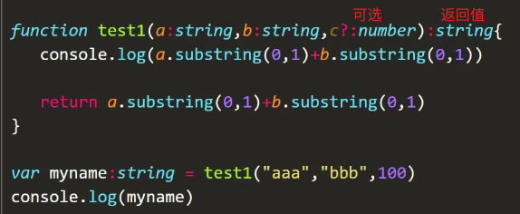
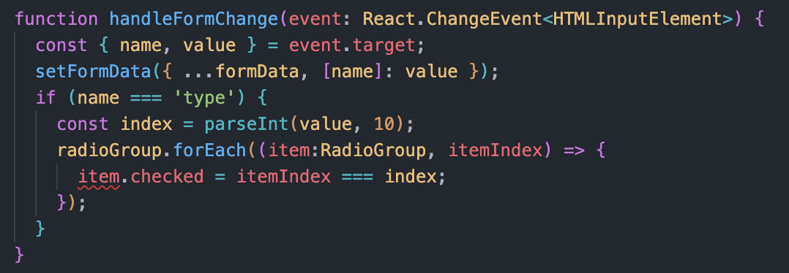
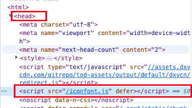
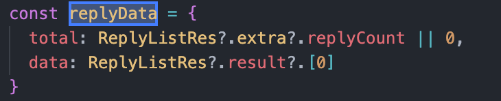
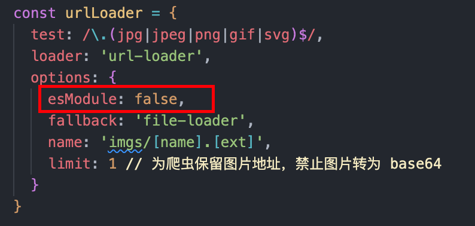

# React

## 01 - 搭建react项目

1、create-react-app

这个不管

```ruby
$ sudo npm install -g create-react-app
```

新建项目

```ruby
$  create-react-app project_name
```

安装react

```kotlin
npm init
npm install --save react react-dom
```

启动项目

```ruby
npm start
```


2、vite

```ruby
npm init vite
```

可选择成react+ts的，这个很快


3、react+ts

```ruby
create-react-app <项目名> --template typescript
```


安装 ts

```ruby
sudo npm install -g typescript
```

查看版本

```ruby
tsc -v
```


先简单点儿，就这些呗～


## 02 - sandbox

### 👉 函数式组件


### 👉 步骤：

1、画出board和square

2、prop传值

3、添加click的事件

4、轮流

5、计算胜方

6、添加历史

7、实现撤回操作


### 👉 小难点1：

```react
<Square value={squares[0]} onSquareClick={handleClick(0)} />
```

```react
function handleClick(i) {
  // 已有棋子 或者 产生胜方
  if (squares[i] || calculateWinner(squares)) {
    return
  }
  // 将值传递给新数组 跟旧数组无关
  const nextSquares = squares.slice()
  if (xIsNext) {
    nextSquares[i] = 'X'
  } else {
    nextSquares[i] = 'O'
  }
  // onPlay(nextSquares)
  setSquares(nextSquares)
  setXIsNext(!xIsNext)
}
```

这里调用的 `handleClick` 函数中有 `setSquares` 改变了棋盘组件的状态，使整个棋盘组件再次重新呈现，就变成了一个无限循环

之前为啥没问题？

```react
function Square({ value, onSquareClick }) {
  return (
    <button className="square" onClick={onSquareClick}>
      {value}
    </button>
  );
}
```

👉 这里 `onSquareClick={handleClick}` 是将 `handleClick` 函数作为 `props` 向下传递的

但是 `handleClick(0)` 中是立即调用了

我们希望的是作为一个props向下传递，但不调用

以下这种方法解决：

```react
<Square value={squares[0]} onSquareClick={() => handleClick(0)} />
```


### 👉 踩坑1：

```react
const [history, setHistory] = useState([Array(9).fill(null)])
```

这里面是数组，外面中括号得加上


### 👉 注意点1：

**构建动态列表时分配适当的键**

如果没有指定key，React会报错，默认使用数组索引作为key

密钥不需要是全局唯一的；它们只需要在组件及其同级组件之间是唯一的


## 03 - FilterableProductTable


### 👉 写法1：

```react
function ProductRow({ product }) {
  const name = product.stocked ? product.name :
    <span style={{ color: 'red' }}>{product.name}</span>

  return (
    <tr>
      <td>{name}</td>
      <td>{product.price}</td>
    </tr>
  )
}
```

我的天呐这个写法，这里的{{}}不是语法规则啊


### 👉 prop & state：

- prop：传递的数据
- state：组件的内存

就是prop和data的感觉


react使用单向数据流

> 对于应用程序中的每个状态：
>
> 1. 识别基于该状态呈现某些内容的*每个组件。*
> 2. 找到它们最接近的公共父组件——在层次结构中位于它们之上的组件。
> 3. 🌟🌟🌟决定状态应该在哪里：
>    1. **通常，您可以将状态直接放入它们的共同父级中。**
>    2. **您还可以将状态放入其共同父级之上的某个组件中。**
>    3. **如果您无法找到一个组件，在这个组件中拥有状态是有意义的，请创建一个新组件，专门用于保存状态，并将其添加到公共父组件之上的层次结构中的某个位置。**
>

所以还需绑定反向数据流

如果不绑定，react会忽略输入


## 04 - 描述用户界面

### 1、组件

- **组件的名称必须以大写字母开头**，否则将无法运行！

- 用jsx语法中，return后不只一行，就要用括号括起来的

- 组件定义不可嵌套，数据传递用prop


### 2、导入导出

- 一个文件可导出多个组件

  ```react
  // 默认导出
  import Gallery from './Gallery.js';
  // 命名导出
  import { Profile } from './Gallery.js';
  ```

  

### 3、jsx

1）返回多个元素，使用单个父标记将它们包装起来

eg：`<> </>`

> #### 为什么需要包裹多个 JSX 标签？
>
> JSX 看起来像 HTML，但在底层它被转换为普通的 JavaScript 对象。
>
> 如果不将它们包装到数组中，则不能从函数返回两个对象。这解释了为什么你也不能返回两个 JSX 标签而不将它们包装到另一个标签或片段中。

2）关闭所有标签

3）camelCase大部分 天呐 我之前犯了大忌啊😱

4）[html -> jsx](https://transform.tools/html-to-jsx)


### 4、花括号

1） `“”` ：指定 字符串

2） `{}`：动态读取

> #### 在哪里使用花括号
>
> 1. **作为**直接在 JSX 标签内的文本：`<h1>{name}'s To Do List</h1>`有效，但`<{tag}>Gregorio Y. Zara's To Do List</{tag}>` 不会。
> 2. **作为**紧跟在`=`符号之后的属性：`src={avatar}`将读取`avatar`变量，但`src="{avatar}"`将传递字符串`"{avatar}"`。

3）`{{}}`

在 JSX 中传递一个 JS 对象，必须将对象包裹在另一对花括号中：`person={{ name: "Hedy Lamarr", inventions: 5 }}`

4）模版字符串拼接

`src={baseUrl + person.imageId + person.imageSize + '.jpg'}`

`src={baseUrl}{person.imageId}{person.imageSize}.jpg"` ❌

或者写成一个utils的函数也行

```react
export function getImageUrl(person, size = 's') {
  return (
    'https://i.imgur.com/' +
    person.imageId +
    size +
    '.jpg'
  );
}
```


### 5、父传子props

1）解构

```react
function Avatar({ person, size = 100 }) {
  // ...
}
```

2）将所有props转发给子组件

```react
function Profile(props) {
  return (
    <div className="card">
      <Avatar {...props} />
    </div>
  );
}
```

3）组件嵌套 - vue的插槽嘛

```react
import Avatar from './Avatar.js';

function Card({ children }) {
  return (
    <div className="card">
      {children}
    </div>
  );
}

export default function Profile() {
  return (
    <Card>
      <Avatar
        size={100}
        person={{ 
          name: 'Katsuko Saruhashi',
          imageId: 'YfeOqp2'
        }}
      />
    </Card>
  );
}
```

4）props是不可变的


### 6、条件渲染

1）if-else

但组件必须返回一些东西（null）

```react
function Item({ name, isPacked }) {
  if (isPacked) {
    return <li className="item">{name} ✔</li>;
  }
  return <li className="item">{name}</li>;
}
```

有点todolist的感觉哦

2）三元表达式

```react
function Item({ name, isPacked }) {
  return (
    <li className="item">
      {isPacked ? (
        <del>
          {name + ' ✔'}
        </del>
      ) : (
        name
      )}
    </li>
  );
}
```

嵌套jsx让代码更dry

3）&&

```react
function Item({ name, isPacked }) {
  return (
    <li className="item">
      {name} {isPacked && '✔'}
    </li>
  );
}
```

4）最灵活版 - 去增加一些变量

```react
function Item({ name, isPacked }) {
  let itemContent = name;
  if (isPacked) {
    itemContent = (
      <del>
        {name + " ✔"}
      </del>
    );
  }
  return (
    <li className="item">
      {itemContent}
    </li>
  );
}
```

5）字符串之间添加空格

`{' '}`


### 7、渲染列表

1）map

```react
const listItems = people.map(person =>
  <li key={person.id}>
    
    <p>
      <b>{person.name}</b>
        {' ' + person.profession + ' '}
        known for {person.accomplishment}
    </p>
  </li>
);
```

这里的箭头函数后面可以是一个父标签诶

如果忍不住外面加个花括号，别忘加return

2）片段列表

fragment 多个dom节点

```react
const listItems = people.map(person =>
  <Fragment key={person.id}>
    <h1>{person.name}</h1>
    <p>{person.bio}</p>
  </Fragment>
);
```

3）key

[`crypto.randomUUID()`](https://developer.mozilla.org/en-US/docs/Web/API/Crypto/randomUUID)

[`uuid`](https://www.npmjs.com/package/uuid)

4）foreach


### 8、保持组件纯净

React 提供了一种“严格模式”，在开发过程中它会调用每个组件的函数两次。**通过两次调用组件函数，严格模式有助于找到违反这些规则的组件。**

要选择进入严格模式，您可以将根组件包装到`<React.StrictMode>`


## 05 - 添加交互

### 1、响应事件

1）事件传播 - 事件冒泡啦～

事件处理程序还将捕获来自您的组件可能具有的任何子组件的事件

所有事件都在 React 中传播，除了`onScroll`，它只适用于你附加的 JSX 标签

2）停止传播

事件处理程序接收一个**事件对象**作为它们唯一的参数。按照惯例，它通常被称为`e`，代表“事件”。您可以使用此对象来读取有关事件的信息

`e.stopPropagation()`

3）阻止默认事件

阻止提交表单后重新加载页面

```react
<form onSubmit={e => {
  e.preventDefault();
  alert('Submitting!');
}}>
  <input />
  <button>Send</button>
</form>
```

- [`e.stopPropagation()`](https://developer.mozilla.org/docs/Web/API/Event/stopPropagation) 停止触发附加到上述标签的事件处理程序。
- [`e.preventDefault()` ](https://developer.mozilla.org/docs/Web/API/Event/preventDefault) 阻止少数事件的默认浏览器行为。


### 2、state：组件的记忆

1）State 

2）Hook [`useState`](https://react.dev/reference/react/useState) 提供了这两件事：

1. 用于保留渲染之间数据的**状态变量**（否则每次都是从头渲染）
2. 一个**状态设置函数**，用于更新变量并触发 React 再次渲染组件

```react
const [index, setIndex] = useState(0);
```

3）hooks

**以`use`开头的函数只能在你的组件的顶层或你自己的钩子上调用。**

4）状态是孤立的和私有的

两次渲染同一个组件，每个组件都会有完全隔离的状态

改变一个其余一个不影响

5）若想同步，子组件移除状态，添加到最近公共父组件中去


### 3、渲染和提交

1）触发渲染

- 最初始的渲染

```react
const root = createRoot(document.getElementById('root'))
root.render(<Image />);
```

- 状态更新时重新渲染

  set函数触发

2）渲染组件

渲染是纯函数

- 相同的输入 相同的输出
- 只管自己的事

3）提交给dom

- **如果渲染结果与上次相同，React 不会触及 DOM**

- 初始渲染，使用`appendChild()`DOM API 将其创建的所有 DOM 节点放在屏幕上

4）浏览器渲染/绘制

渲染完成并且 React 更新 DOM 后，浏览器将重新绘制屏幕


### 4、state如同一张快照

1）设置state会触发渲染

> 当 React 重新渲染一个组件时：
>
> 1. React 会再次调用你的函数
> 2. 你的函数会返回新的 JSX 快照
> 3. React 会更新界面来匹配你返回的快照
>

2）**设置 state 只会为 \*下一次\* 渲染变更 state 的值**

一个 state 变量的值永远不会在一次渲染的内部发生变化， **即使其事件处理函数的代码是异步的**（加个setTimeOut也没用）

👉 原因：React 会等到事件处理函数中的 所有 代码都运行完毕再处理 state 更新 - **批处理**

3）**React 不会跨 \*多个\* 需要刻意触发的事件（如点击）进行批处理**

React 只会在一般来说安全的情况下才进行批处理。这可以确保，例如，如果第一次点击按钮会禁用表单，那么第二次点击就不会再次提交它。


### 5、把一系列 state 更新加入队列

1）在下次渲染前多次更新同一个 state

`setNumber(n => n + 1)` 这样传入一个根据队列中的前一个 state 计算下一个 state 的 *函数*，而不是像 `setNumber(number + 1)` 这样传入 *下一个 state 值* 【**更新函数**】

👉 告诉 React “用 state 值做某事”而不是仅仅替换它的方法。

> 1. React 会将此函数加入队列，以便在事件处理函数中的所有其他代码运行后进行处理
> 2. 在下一次渲染期间，React 会遍历队列并给你更新之后的最终 state

2）命名：

- state 变量的第一个字母

```react
setEnabled(e => !e);
setLastName(ln => ln.reverse());
```

- 使用完整的 state 变量

```react
setEnabled(enabled => !enabled)
setEnabled(prevEnabled => !prevEnabled)
```

3）🌟🌟🌟 总结：

- **set不会更改现有渲染中的变量，只会请求下一次渲染，改变下一次渲染的值**

- **在渲染前更新同一个state用事件处理函数**


### 6、更新状态中的对象

1）更新一个对象时，需要创建一个新对象（或复制一个现有对象），然后设置状态

2）突变：

更改对象本身的内容

```react
position.x = 5;
```

3）**将放入state的任何 JavaScript 对象视为只读**

如果不使用状态设置函数，React 并不知道对象发生了变化。所以 React 不会做任何响应

👉 **请创建一个\*新\*对象并将其传递给状态设置函数**

```react
onPointerMove={e => {
  setPosition({
    x: e.clientX,
    y: e.clientY
  });
}}
```

4）使用传播语法来创建对象的副本

```react
function handleChange(e) {
  setPerson({
    ...person,
    [e.target.name]: e.target.value
  });
}
```

- 传播语法很浅：它只复制一层深。

5）更新嵌套对象

```react
function handleImageChange(e) {
  setPerson({
    ...person,
    artwork: {
      ...person.artwork,
      image: e.target.value
    }
  });
}
```

6）嵌套很深，使用 [Immer](https://github.com/immerjs/use-immer)，保持更新处理程序简洁

useImmer

```react
updatePerson(draft => {
  draft.artwork.city = 'Lagos';
});
```

还挺绝


### 7、更新state中的数组

跟对象同理

|          | 避免使用 (会改变原始数组)     | 推荐使用 (会返回一个新数组）                                 |
| -------- | ----------------------------- | ------------------------------------------------------------ |
| 添加元素 | `push`，`unshift`             | `concat`，`[...arr]` 展开语法（[例子](https://react.docschina.org/learn/updating-arrays-in-state#adding-to-an-array)） |
| 删除元素 | `pop`，`shift`，`splice`      | `filter`，`slice`（[例子](https://react.docschina.org/learn/updating-arrays-in-state#removing-from-an-array)） |
| 替换元素 | `splice`，`arr[i] = ...` 赋值 | `map`（[例子](https://react.docschina.org/learn/updating-arrays-in-state#replacing-items-in-an-array)） |
| 排序     | `reverse`，`sort`             | 先将数组复制一份（[例子](https://react.docschina.org/learn/updating-arrays-in-state#making-other-changes-to-an-array)） |

或者使用immer，就可以使用所有数组的方法

1）添加

push

```react
setArtists( // 替换 state
  [ // 是通过传入一个新数组实现的
    ...artists, // 新数组包含原数组的所有元素
    { id: nextId++, name: name } // 并在末尾添加了一个新的元素
  ]
);
```

unshift

```react
setArtists([
  { id: nextId++, name: name },
  ...artists // 将原数组中的元素放在末尾
]);
```

2）删除

```react
<ul>
  {artists.map(artist => (
    <li key={artist.id}>
      {artist.name}{' '}
      <button onClick={() => {
        setArtists(
          artists.filter(a =>
            a.id !== artist.id
          )
        );
      }}>
        删除
      </button>
    </li>
  ))}
</ul>
```

之后会用诶

3）替换

数组

```react
function handleClick() {
  const nextShapes = shapes.map(shape => {
    if (shape.type === 'square') {
      // 不作改变
      return shape;
    } else {
      // 返回一个新的圆形，位置在下方 50px 处
      return {
        ...shape,
        y: shape.y + 50,
      };
    }
  });
  // 使用新的数组进行重渲染
  setShapes(nextShapes);
}
```

数组的元素

```react
function handleIncrementClick(index) {
  const nextCounters = counters.map((c, i) => {
    if (i === index) {
      // 递增被点击的计数器数值
      return c + 1;
    } else {
      // 其余部分不发生变化
      return c;
    }
  });
  setCounters(nextCounters);
}
```

插入数组元素 - 特定位置

```react
function handleClick() {
  const insertAt = 1; // 可能是任何索引
  const nextArtists = [
    // 插入点之前的元素：
    ...artists.slice(0, insertAt),
    // 新的元素：
    { id: nextId++, name: name },
    // 插入点之后的元素：
    ...artists.slice(insertAt)
  ];
  setArtists(nextArtists);
  setName('');
}
```

4）翻转数组 / 排序数组

拷贝(浅拷贝) -> 改变 -> 设置

`reverse()` 或 `sort()`

```react
function handleClick() {
  const nextList = [...list];
  nextList.reverse();
  setList(nextList);
}
```

由于浅拷贝，所以不能直接去改变数组内部的某个对象

5）更新数组内部的对象 

```react
function handleToggleMyList(artworkId, nextSeen) {
  setMyList(myList.map(artwork => {
    if (artwork.id === artworkId) {
      // 创建包含变更的*新*对象
      return { ...artwork, seen: nextSeen };
    } else {
      // 没有变更
      return artwork;
    }
  }));
}
```


## 06 - 状态管理

### 1、用state响应输入

声明式考虑ui

1）定位组件中不同的视图状态

2）确定是什么触发了这些状态的改变

- **人为**输入 - 事件处理函数
- **计算机**输入


3）通过 `useState` 表示内存中的 state

4）删除任何不必要的 state 变量

5）连接事件处理函数以设置 state


## 07 - fragment

React Fragment 是 React 中的一个特性，它允许你对一组子元素进行分组，而无需向 DOM 添加额外的节点，从而允许你从 React 组件中返回多个元素

- 在Vue2中，template里不能有多个根组件存在

- 但Vue3支持**Fragments**，这意味着组件可以具有多个根节点
- React也一样支持**Fragments**，而且还提供了一个简写符号 `<></>` 将多个元素封装在一起，其工作原理与 React Fragment 类似，但内存负载更低


# TS

官方文档：[React TypeScript Cheatsheets | React TypeScript Cheatsheets (react-typescript-cheatsheet.netlify.app)](https://react-typescript-cheatsheet.netlify.app/)


- 数组


- 对象


- 函数




- 对象，函数作为属性


- 类


- 类+接口


- 函数式组件


- todo


-  props


或者


- 点击控制显隐


## 1.创建一个组件

下面我们将要创建一个`Hello`组件。 这个组件接收任意一个我们想对之打招呼的名字（我们把它叫做`name`），并且有一个可选数量的感叹号做为结尾（通过`enthusiasmLevel`）。

若我们这样写`<Hello name="Daniel" enthusiasmLevel={3} />`，这个组件大至会渲染成`<div>Hello Daniel!!!</div>`。 如果没指定`enthusiasmLevel`，组件将默认显示一个感叹号。 若`enthusiasmLevel`为`0`或负值将抛出一个错误。

下面来写一下`Hello.tsx`：

```tsx
// src/components/Hello.tsx

import * as React from 'react';

export interface Props {
  name: string;
  enthusiasmLevel?: number;
}

function Hello({ name, enthusiasmLevel = 1 }: Props) {
  if (enthusiasmLevel <= 0) {
    throw new Error('You could be a little more enthusiastic. :D');
  }

  return (
    <div className="hello">
      <div className="greeting">
        Hello {name + getExclamationMarks(enthusiasmLevel)}
      </div>
    </div>
  );
}

export default Hello;

// helpers

function getExclamationMarks(numChars: number) {
  return Array(numChars + 1).join('!');
}
```

注意我们定义了一个类型`Props`，它指定了我们组件要用到的属性。 `name`是必需的且为`string`类型，同时`enthusiasmLevel`是可选的且为`number`类型（你可以通过名字后面加`?`为指定可选参数）。

我们创建了一个无状态的函数式组件（Stateless Functional Components，SFC）`Hello`。 具体来讲，`Hello`是一个函数，接收一个`Props`对象并拆解它。 如果`Props`对象里没有设置`enthusiasmLevel`，默认值为`1`。

使用函数是React中定义组件的[两种方式](https://facebook.github.io/react/docs/components-and-props.html#functional-and-class-components)之一。 如果你喜欢的话，也*可以*通过类的方式定义：

```tsx
class Hello extends React.Component<Props, object> {
  render() {
    const { name, enthusiasmLevel = 1 } = this.props;

    if (enthusiasmLevel <= 0) {
      throw new Error('You could be a little more enthusiastic. :D');
    }

    return (
      <div className="hello">
        <div className="greeting">
          Hello {name + getExclamationMarks(enthusiasmLevel)}
        </div>
      </div>
    );
  }
}
```

当我们的[组件具有某些状态](https://facebook.github.io/react/docs/state-and-lifecycle.html)的时候，使用类的方式是很有用处的。 但在这个例子里我们不需要考虑状态 - 事实上，在`React.Component<Props, object>`我们把状态指定为了`object`，因此使用SFC更简洁。 当在创建可重用的通用UI组件的时候，在表现层使用组件局部状态比较适合。 针对我们应用的生命周期，我们会审视应用是如何通过Redux轻松地管理普通状态的。

现在我们已经写好了组件，让我们仔细看看`index.tsx`，把`<App />`替换成`<Hello ... />`。

首先我们在文件头部导入它：

```js
import Hello from './components/Hello.tsx';
```

然后修改`render`调用：

```tsx
ReactDOM.render(
  <Hello name="TypeScript" enthusiasmLevel={10} />,
  document.getElementById('root') as HTMLElement
);
```

这里还有一点要指出，就是最后一行`document.getElementById('root') as HTMLElement`。 这个语法叫做*类型断言*，有时也叫做*转换*。 当你比类型检查器更清楚一个表达式的类型的时候，你可以通过这种方式通知TypeScript。

这里，我们之所以这么做是因为`getElementById`的返回值类型是`HTMLElement | null`。 简单地说，`getElementById`返回`null`是当无法找对对应`id`元素的时候。 我们假设`getElementById`总是成功的，因此我们要使用`as`语法告诉TypeScript这点。

TypeScript还有一种感叹号（`!`）结尾的语法，它会从前面的表达式里移除`null`和`undefined`。 所以我们也*可以*写成`document.getElementById('root')!`，但在这里我们想写的更清楚些。

## 2.React中内置函数

> React中内置函数由很多，我们就挑几个常用的来学习一下。

### 2.1 React.FC< P >

> React.FC<>是函数式组件在TypeScript使用的一个泛型，FC就是FunctionComponent的缩写，事实上React.FC可以写成React.FunctionComponent。

```tsx
import React from 'react';
 
interface demo1PropsInterface {
    attr1: string,
    attr2 ?: string,
    attr3 ?: 'w' | 'ww' | 'ww'
};
 
// 函数组件，其也是类型别名
// type FC<P = {}> = FunctionComponent<P>;
// FunctionComponent<T>是一个接口，里面包含其函数定义和对应返回的属性
// interface FunctionComponent<P = {}> {
//      // 接口可以表示函数类型，通过给接口定义一个调用签名实现
//      (props: PropsWithChildren<P>, context?: any): ReactElement<any, any> | null;
//      propTypes?: WeakValidationMap<P> | undefined;
//      contextTypes?: ValidationMap<any> | undefined;
//      defaultProps?: Partial<P> | undefined;
//      displayName?: string | undefined;
// }
const Demo1: React.FC<demo1PropsInterface> = ({
    attr1,
    attr2,
    attr3
}) => {
    return (
        <div>hello demo1 {attr1}</div>
    );
};
 
export default Demo1;
```

### 2.2 React.Component< P, S >

> React.Component< P, S > 是定义class组件的一个泛型，第一个参数是props、第二个参数是state。

```tsx
import React from "react";
 
// props的接口
interface demo2PropsInterface {
    props1: string
};
 
// state的接口
interface demo2StateInterface {
    state1: string
};
 
class Demo2 extends React.Component<demo2PropsInterface, demo2StateInterface> {
    constructor(props: demo2PropsInterface) {
        super(props);
        this.state = {
            state1: 'state1'
        }
    }
 
    render() {
        return (
            <div>{this.state.state1 + this.props.props1}</div>
        );
    }
}
 
export default Demo2;
```

### 2.3 React.Reducer<S, A>

> useState的替代方案，接收一个形如（state, action) => newState的reducer，并返回当前state以及其配套的dispatch方法。语法如下所示：`const [state, dispatch] = useReducer(reducer, initialArg, init);`

```tsx
import React, {useReducer, useContext} from "react";
 
interface stateInterface {
    count: number
};

interface actionInterface {
    type: string,
    data: {
        [propName: string]: any
    }
};
 
const initialState = {
    count: 0
};
 
// React.Reducer其实是类型别名，其实质上是type Reducer<S, A> = (prevState: S, action: A) => S;
// 因为reducer是一个函数，其接受两个泛型参数S和A，返回S类型
const reducer: React.Reducer<stateInterface, actionInterface> = (state, action) => {
    const {type, data} = action;
    switch (type) {
        case 'increment': {
            return {
                ...state,
                count: state.count + data.count
            };
        }
        case 'decrement': {
            return {
                ...state,
                count: state.count - data.count
            };
        }
        default: {
            return state;
        }
    }
}
```

### 2.4 `React.Context<T>`

1. React.createContext

> 其会创建一个Context对象，当React渲染一个订阅了这个Context对象的组件，这个组件会从组件树中离自身最近的那个匹配的Provider中读取到当前的context值。【注：只要当组件所处的树没有匹配到Provider时，其defaultValue参数参会生效】

```jsx

const MyContext = React.createContext(defaultValue);
 
const Demo = () => {
  return (
      // 注：每个Context对象都会返回一个Provider React组件，它允许消费组件订阅context的变化。
    <MyContext.Provider value={xxxxxx}>
      // ……
    </MyContext.Provider>
  );
```

2. useContext

> 接收一个 context 对象（React.createContext 的返回值）并返回该 context 的当前值。当前的 context 值由上层组件中距离当前组件最近的 <MyContext.Provider> 的 value prop 决定。语法如下所示：`const value = useContext(MyContext);`

```jsx
import React, {useContext} from "react";
const MyContext = React.createContext('');
 
const Demo3Child: React.FC<{}> = () => {
    const context = useContext(MyContext);
    return (
        <div>
            {context}
        </div>
    );
}
 
const Demo3: React.FC<{}> = () => {
 
    return (
        <MyContext.Provider value={'222222'}>
            <MyContext.Provider value={'33333'}>
                <Demo3Child />
            </MyContext.Provider>
        </MyContext.Provider>
    );
};
```

3. 使用

```tsx
import React, {useReducer, useContext} from "react";
 
interface stateInterface {
    count: number
};

interface actionInterface {
    type: string,
    data: {
        [propName: string]: any
    }
};
 
const initialState = {
    count: 0
};
 
const reducer: React.Reducer<stateInterface, actionInterface> = (state, action) => {
    const {type, data} = action;
    switch (type) {
        case 'increment': {
            return {
                ...state,
                count: state.count + data.count
            };
        }
        case 'decrement': {
            return {
                ...state,
                count: state.count - data.count
            };
        }
        default: {
            return state;
        }
    }
}
 
// React.createContext返回的是一个对象，对象接口用接口表示
// 传入的为泛型参数，作为整个接口的一个参数
// interface Context<T> {
//      Provider: Provider<T>;
//      Consumer: Consumer<T>;
//      displayName?: string | undefined;
// }
const MyContext: React.Context<{
    state: stateInterface,
    dispatch ?: React.Dispatch<actionInterface>
}> = React.createContext({
    state: initialState
});
 
const Demo3Child: React.FC<{}> = () => {
    const {state, dispatch} = useContext(MyContext);
    const handleClick = () => {
        if (dispatch) {
            dispatch({
                type: 'increment',
                data: {
                    count: 10
                }
            })
        }
    };
    return (
        <div>
            {state.count}
            <button onClick={handleClick}>增加</button>
        </div>
    );
}
 
const Demo3: React.FC<{}> = () => {
    const [state, dispatch] = useReducer(reducer, initialState);
 
    return (
        <MyContext.Provider value={{state, dispatch}}>
            <Demo3Child />
        </MyContext.Provider>
    );
};
 
export default Demo3;
```

## 3.React中事件处理函数

> React中的事件是我们在编码中经常用的，例如onClick、onChange、onMouseMove等，那么应该如何用呢？

### 3.1 不带event参数

> 当对应的事件处理函数不带event参数时，这个时候用起来很简单，如下所示：

```jsx
const Test: React.FC<{}> = () => {
    const handleClick = () => {
        // 做一系列处理
    };
    return (
        <div>
            <button onClick={handleClick}>按钮</button>
        </div>
    );
};
```

### 3.2 带event参数

1. 带上event参数，报错

```jsx
const Test: React.FC<{}> = () => {
    // 报错了，注意不要这么写……
    const handleClick = event => {
        // 做一系列处理
        event.preventDefault();
    };
    return (
        <div>
            <button onClick={handleClick}>按钮</button>
        </div>
    );
};
```

2. 点击onClick参数，跳转到index.d.ts文件

```ts
// onClick是MouseEventHandler类型
onClick?: MouseEventHandler<T> | undefined;
 
// 那MouseEventHandler<T>又是啥？原来是个类型别名，泛型是Element类型
type MouseEventHandler<T = Element> = EventHandler<MouseEvent<T>>;
 
// 那么泛型Element又是什么呢？其是一个接口，通过继承该接口实现了很多其它接口
interface Element { }
interface HTMLElement extends Element { }
interface HTMLButtonElement extends HTMLElement { }
interface HTMLInputElement extends HTMLElement { }
// ……
```

至此，就知道该位置应该怎么实现了

```tsx
const Test: React.FC<{}> = () => {
    const handleClick: React.MouseEventHandler<HTMLButtonElement> = event => {
        // 做一系列处理
        event.preventDefault();
    };
    return (
        <div>
            <button onClick={handleClick}>按钮</button>
        </div>
    );
};
```

### 3.3 表单事件

```tsx
// 如果不考虑性能的话，可以使用内联处理，注解将自动正确生成
const el = (
    <button onClick=(e=>{
        //...
    })/>
)
// 如果需要在外部定义类型
handlerChange = (e: React.FormEvent<HTMLInputElement>): void => {
    //
}
// 如果在=号的左边进行注解
handlerChange: React.ChangeEventHandler<HTMLInputElement> = e => {
    //
}
// 如果在form里onSubmit的事件,React.SyntheticEvent,如果有自定义类型，可以使用类型断言
<form
  ref={formRef}
  onSubmit={(e: React.SyntheticEvent) => {
    e.preventDefault();
    const target = e.target as typeof e.target & {
      email: { value: string };
      password: { value: string };
    };
    const email = target.email.value; // typechecks!
    // etc...
  }}
>
  <div>
    <label>
      Email:
      <input type="email" name="email" />
    </label>
  </div>
  <div>
    <input type="submit" value="Log in" />
  </div>
</form>
```

### 3.4 事件类型列表

```css
AnimationEvent ： css动画事件
ChangeEvent：<input>， <select>和<textarea>元素的change事件
ClipboardEvent： 复制，粘贴，剪切事件
CompositionEvent：由于用户间接输入文本而发生的事件(例如，根据浏览器和PC的设置，如果你想在美国键盘上输入日文，可能会出现一个带有额外字符的弹出窗口)
DragEvent：在设备上拖放和交互的事件
FocusEvent: 元素获得焦点的事件
FormEvent: 当表单元素得失焦点/value改变/表单提交的事件
InvalidEvent: 当输入的有效性限制失败时触发(例如<input type="number" max="10">，有人将插入数字20)
KeyboardEvent: 键盘键入事件
MouseEvent： 鼠标移动事件
PointerEvent： 鼠标、笔/触控笔、触摸屏)的交互而发生的事件
TouchEvent： 用户与触摸设备交互而发生的事件
TransitionEvent： CSS Transition，浏览器支持度不高
UIEvent：鼠标、触摸和指针事件的基础事件。
WheelEvent: 在鼠标滚轮或类似的输入设备上滚动
SyntheticEvent：所有上述事件的基础事件。是否应该在不确定事件类型时使用
// 因为InputEvent在各个浏览器支持度不一样，所以可以使用KeyboardEvent代替
```

## 4.普通函数

1. 一个具体类型的输入输出函数

```ts
// 参数输入为number类型，通过类型判断直接知道输出也为number
function testFun1 (count: number) {
    return count * 2;
}
```

2. 一个不确定类型的输入、输出函数，但是输入、输出函数类型一致

```ts
// 用泛型
function testFun2<T> (arg: T): T {
    return arg;
}
```

3. async函数，返回的为Promise对象，可以使用then方法添加回调函数，Promise是一个泛型函数，T泛型变量用于确定then方法时接收的第一个回调函数的参数类型。

```tsx
// 用接口
interface PResponse<T> {
    result: T,
    status: string
};
 
// 除了用接口外，还可以用对象
// type PResponse<T> = {
//   	result: T,
//    status: string
// };
 
async function testFun3(): Promise<PResponse<number>> {
    return {
        status: 'success',
        result: 10
    }
}
```

## 5.React Prop 类型

- 如果你有配置 `Eslint` 等一些代码检查时，一般函数组件需要你定义返回的类型，或传入一些 `React` 相关的类型属性。
  这时了解一些 `React` 自定义暴露出的类型就很有必要了。例如常用的 `React.ReactNode`。

```tsx
export declare interface AppProps {
    children1: JSX.Element; // ❌ bad, 没有考虑数组类型
    children2: JSX.Element | JSX.Element[]; // ❌ 没考虑字符类型
    children3: React.ReactChildren; // ❌ 名字唬人，工具类型，慎用
    children4: React.ReactChild[]; // better, 但没考虑 null
    children: React.ReactNode; // ✅ best, 最佳接收所有 children 类型
    functionChildren: (name: string) => React.ReactNode; // ✅ 返回 React 节点

    style?: React.CSSProperties; // React style

    onChange?: React.FormEventHandler<HTMLInputElement>; // 表单事件! 泛型参数即 `event.target` 的类型
}
```

`defaultProps` 默认值问题。

```typescript
type GreetProps = { age: number } & typeof defaultProps;
const defaultProps = {
    age: 21,
};

const Greet = (props: GreetProps) => {
    // etc
};
Greet.defaultProps = defaultProps;
```

- 你可能不需要 defaultProps

```typescript
type GreetProps = { age?: number };

const Greet = ({ age = 21 }: GreetProps) => { 
    // etc 
};
```

## 6.Hooks

项目基本上都是使用函数式组件和 `React Hooks`。
接下来介绍常用的用 TS 编写 Hooks 的方法。

### 6.1 useState

- 给定初始化值情况下可以直接使用

```tsx
import { useState } from 'react';
// ...
const [val, toggle] = useState(false);
// val 被推断为 boolean 类型
// toggle 只能处理 boolean 类型
```

- 没有初始值（undefined）或初始 null

```tsx
type AppProps = { message: string };
const App = () => {
    const [data] = useState<AppProps | null>(null);
    // const [data] = useState<AppProps | undefined>();
    return <div>{data && data.message}</div>;
};
```

- 更优雅，链式判断

```typescript
// data && data.message
data?.message
```

### 6.2 useEffect

- 有点像依赖注入诶，可以向深层次的组件传值

```react
import { useState, createContext, useContext } from "react";
import ReactDOM from "react-dom/client";

const UserContext = createContext();

function Component1() {
  const [user, setUser] = useState("Jesse Hall");

  return (
    <UserContext.Provider value={user}>
      <h1>{`Hello ${user}!`}</h1>
      <Component2 />
    </UserContext.Provider>
  );
}

function Component2() {
  return (
    <>
      <h1>Component 2</h1>
      <Component3 />
    </>
  );
}

function Component3() {
  return (
    <>
      <h1>Component 3</h1>
      <Component4 />
    </>
  );
}

function Component4() {
  return (
    <>
      <h1>Component 4</h1>
      <Component5 />
    </>
  );
}

function Component5() {
  const user = useContext(UserContext);

  return (
    <>
      <h1>Component 5</h1>
      <h2>{`Hello ${user} again!`}</h2>
    </>
  );
}

const root = ReactDOM.createRoot(document.getElementById('root'));
root.render(<Component1 />);
```

- 还像watch啊，一个变量依赖另一个变量的值动态变化，也用它啊

- 使用 `useEffect` 时传入的函数简写要小心，它接收一个无返回值函数或一个清除函数。

```tsx
function DelayedEffect(props: { timerMs: number }) {
    const { timerMs } = props;

    useEffect(
        () =>
            setTimeout(() => {
                /* do stuff */
            }, timerMs),
        [timerMs]
    );
    // ❌ bad example! setTimeout 会返回一个记录定时器的 number 类型
    // 因为简写，箭头函数的主体没有用大括号括起来。
    return null;
}
```

- 看看 `useEffect`接收的第一个参数的类型定义。

```tsx
// 1. 是一个函数
// 2. 无参数
// 3. 无返回值 或 返回一个清理函数，该函数类型无参数、无返回值 。
type EffectCallback = () => (void | (() => void | undefined));
```

- 了解了定义后，只需注意加层大括号。

```tsx
function DelayedEffect(props: { timerMs: number }) {
    const { timerMs } = props;

    useEffect(() => {
        const timer = setTimeout(() => {
            /* do stuff */
        }, timerMs);

        // 可选
        return () => clearTimeout(timer);
    }, [timerMs]);
    // ✅ 确保函数返回 void 或一个返回 void|undefined 的清理函数
    return null;
}
```

- 同理，async 处理异步请求，类似传入一个 `() => Promise<void>` 与 `EffectCallback` 不匹配。

```tsx
// ❌ bad
useEffect(async () => {
    const { data } = await ajax(params);
    // todo
}, [params]);
```

- 异步请求，处理方式：

```tsx
// ✅ better
useEffect(() => {
    (async () => {
        const { data } = await ajax(params);
        // todo
    })();
}, [params]);

// 或者 then 也是可以的
useEffect(() => {
    ajax(params).then(({ data }) => {
        // todo
    });
}, [params]);
```

### 6.3 useRef

`useRef` 一般用于两种场景

1. 引用 `DOM` 元素；
2. 不想作为其他 `hooks` 的依赖项，因为 `ref` 的值引用是不会变的，变的只是 `ref.current`。

- 使用 `useRef` ，可能会有两种方式。

```tsx
const ref1 = useRef<HTMLElement>(null!);
const ref2 = useRef<HTMLElement | null>(null);
```

- 非 null 断言 `null!`。断言之后的表达式非 null、undefined

```tsx
function MyComponent() {
    const ref1 = useRef<HTMLElement>(null!);
    useEffect(() => {
        doSomethingWith(ref1.current);
        // 跳过 TS null 检查。e.g. ref1 && ref1.current
    });
    return <div ref={ref1}> etc </div>;
}
```

- 不建议使用 `!`，存在隐患，Eslint 默认禁掉。

```tsx
function TextInputWithFocusButton() {
    // 初始化为 null, 但告知 TS 是希望 HTMLInputElement 类型
    // inputEl 只能用于 input elements
    const inputEl = React.useRef<HTMLInputElement>(null);
    const onButtonClick = () => {
        // TS 会检查 inputEl 类型，初始化 null 是没有 current 上是没有 focus 属性的
        // 你需要自定义判断! 
        if (inputEl && inputEl.current) {
            inputEl.current.focus();
        }
        // ✅ best
        inputEl.current?.focus();
    };
    return (
        <>
            <input ref={inputEl} type="text" />
            <button onClick={onButtonClick}>Focus the input</button>
        </>
    );
}
```

### 6.4 useReducer

使用 `useReducer` 时，多多利用 Discriminated Unions 来精确辨识、收窄确定的 `type` 的 `payload` 类型。
一般也需要定义 `reducer` 的返回类型，不然 TS 会自动推导。

- 又是一个联合类型收窄和避免拼写错误的精妙例子。

```tsx
const initialState = { count: 0 };

// ❌ bad，可能传入未定义的 type 类型，或码错单词，而且还需要针对不同的 type 来兼容 payload
// type ACTIONTYPE = { type: string; payload?: number | string };

// ✅ good
type ACTIONTYPE =
    | { type: 'increment'; payload: number }
    | { type: 'decrement'; payload: string }
    | { type: 'initial' };

function reducer(state: typeof initialState, action: ACTIONTYPE) {
    switch (action.type) {
        case 'increment':
            return { count: state.count + action.payload };
        case 'decrement':
            return { count: state.count - Number(action.payload) };
        case 'initial':
            return { count: initialState.count };
        default:
            throw new Error();
    }
}

function Counter() {
    const [state, dispatch] = useReducer(reducer, initialState);
    return (
        <>
            Count: {state.count}            
		   <button onClick={() => dispatch({ type: 'decrement', payload: '5' })}>-</button>
            <button onClick={() => dispatch({ type: 'increment', payload: 5 })}>+</button>
        </>
    );
}
```

### 6.5 useContext

一般 `useContext` 和 `useReducer` 结合使用，来管理全局的数据流。

- 例子

```tsx
interface AppContextInterface {
    state: typeof initialState;
    dispatch: React.Dispatch<ACTIONTYPE>;
}

const AppCtx = React.createContext<AppContextInterface>({
    state: initialState,
    dispatch: (action) => action,
});
const App = (): React.ReactNode => {
    const [state, dispatch] = useReducer(reducer, initialState);

    return (
        <AppCtx.Provider value={{ state, dispatch }}>
            <Counter />
        </AppCtx.Provider>
    );
};

// 消费 context
function Counter() {
    const { state, dispatch } = React.useContext(AppCtx);
    return (
        <>
            Count: {state.count}            
		   <button onClick={() => dispatch({ type: 'decrement', payload: '5' })}>-</button>
            <button onClick={() => dispatch({ type: 'increment', payload: 5 })}>+</button>
        </>
    );
}
```

### 6.6 useImperativeHandle, forwardRef

推荐使用一个自定义的 `innerRef` 来代替原生的 `ref`，否则要用到 `forwardRef` 会搞的类型很复杂。

```tsx
type ListProps = {
  innerRef?: React.Ref<{ scrollToTop(): void }>
}

function List(props: ListProps) {
  useImperativeHandle(props.innerRef, () => ({
    scrollToTop() { }
  }))
  return null
}
```

结合刚刚 useRef 的知识，使用是这样的：

```tsx
function Use() {
  const listRef = useRef<{ scrollToTop(): void }>(null!)

  useEffect(() => {
    listRef.current.scrollToTop()
  }, [])

  return (
    <List innerRef={listRef} />
  )
}
```

很完美，是不是？

可以在线调试 [useImperativeHandle 的例子](https://www.typescriptlang.org/play?#code/JYWwDg9gTgLgBAKjgQwM5wEoFNkGN4BmUEIcA5FDvmQNwCwAUKJLHAN5wCuqWAyjMhhYANFx4BRAgSz5R3LNgJyeASXBYog4ADcsACWQA7ACYAbLHAC+cIiXKU8MWo0YwAnmAsAZYKhgAFYjB0AF52Rjg4YENDDUUAfgAuTCoYADpFAB4OVFxiU1MAFQhisAAKAEpk7QhgYysAPkZLFwYCTkN8YAhDOB8-MrAg1GT+gOGK8IZI+TVPTRgdfSMzLEHhtOjYqEVRSrgQhrgytgjIuFz8opKIcsmOFumrCoqzyhhOKF7DTgLm1vanUWPTgAFUePtTk9cD0-HBTL4YIoDmIFFgCNkLnkIAViqVKtVavVLA0yj8CgBCV4MM7ySTSfBlfaHKbneGIxRpXCfSiGdKXHHXfHUyKWUQAbQAutS3lgPl9jmdIpkxlEYnF0SE2Ai-IprAB6JpPamWIA)。

### 6.6 自定义 Hooks

`Hooks` 的美妙之处不只有减小代码行的功效，重点在于能够做到逻辑与 UI 分离。做纯粹的逻辑层复用。

- 例子：当你自定义 Hooks 时，返回的数组中的元素是确定的类型，而不是联合类型。可以使用 const-assertions 。

```typescript
export function useLoading() {
    const [isLoading, setState] = React.useState(false);
    const load = (aPromise: Promise<any>) => {
        setState(true);
        return aPromise.finally(() => setState(false));
    };
    return [isLoading, load] as const; // 推断出 [boolean, typeof load]，而不是联合类型 (boolean | typeof load)[]
}
```

- 也可以断言成 `tuple type` 元组类型。

```typescript
export function useLoading() {
    const [isLoading, setState] = React.useState(false);
    const load = (aPromise: Promise<any>) => {
        setState(true);
        return aPromise.finally(() => setState(false));
    };
    return [isLoading, load] as [
        boolean, 
        (aPromise: Promise<any>) => Promise<any>
    ];
}
```

- 如果对这种需求比较多，每个都写一遍比较麻烦，可以利用泛型定义一个辅助函数，且利用 TS 自动推断能力。

```typescript
function tuplify<T extends any[]>(...elements: T) {
    return elements;
}

function useArray() {
    const numberValue = useRef(3).current;
    const functionValue = useRef(() => {}).current;
    return [numberValue, functionValue]; // type is (number | (() => void))[]
}

function useTuple() {
    const numberValue = useRef(3).current;
    const functionValue = useRef(() => {
    }).current;
    return tuplify(numberValue, functionValue); // type is [number, () => void]
}
```


# TS 的坑坑坑🕳️

### 01 使用context，value一直报错


虽然知道是类型的错误，但想了半天也没出来是哪里的问题


是在createContext的时候设定默认值的类型不对，改成一样的就好啦


### 02 useEffect疯狂报错 但是不需要添加这个依赖


` // eslint-disable-next-line react-hooks/exhaustive-deps `

上面加一句话，跳过这个eslint检查

但我也不知道合不合适诶，运行没问题

👉 应该没问题，我在其他项目里看到这么用的了


### 03 props-type报错


很奇怪，明明用了FromProps定义了，但用结构赋值就是显示缺失规则


那就只能把prop-types规则禁用掉了


04 




同样增加规则

`'no-param-reassign': 0,`


# todoList

2023-5-5

用react+ts颤颤巍巍写了个todoList，还好导师没有让我疯狂改代码🥹

学习：（没有编辑全选功能）

https://github.com/8bitnikita/todolist-app/tree/master

ts的类型检查好痛苦，但也有点C++的感觉

[ts常用事件](https://www.51cto.com/article/706875.html)

和vue写的逻辑是一样的，没有了vue的双向绑定和watch、computed这些，实现方法要变一变

之前看codewhy的课讲到的函数式编程，原来是这样啊🤔


### 无状态组件 & 有状态组件

- 无状态组件

  使用`class`关键字创建的组件，有自己的私有数据`this.state`和生命周期函数就是有状态组件

  - 只负责接收`props`渲染`DOM`，不维护自己的`state`
  - 不能访问生命周期方法
  - 不需要声明类，可以避免`extends`或`constructor`之类的代码，语法上更加简洁
  - 不会被实例化，因此不能直接传`ref`，可以使用`React.forwardRef`包装后再传`ref`
  - 不需要显示声明`this`关键字，在`ES6`的类声明中往往需要将函数的`this`关键字绑定到当前作用域，而因为函数式声明的特性，我们不需要再强制绑定
  - 更好的性能表现，因为函数式组件中并不需要进行生命周期的管理与状态管理，因此`React`并不需要进行某些特定的检查或者内存分配，从而保证了更好地性能表现。

- 有状态组件

  使用`function`创建的组件，只有`props`没有自己的私有数据和生命周期函数就是无状态组件。

  有状态组件`Stateful Component`是在无状态组件的基础上，组件内部包含状态`state`且状态随着事件或者外部的消息而发生改变


### 🌟 Hooks 出现的本质原因

- **让函数组件也能做类组件的事，有自己的状态，可以处理一些副作用，能获取 ref ，也能做数据缓存**
- **解决逻辑复用难的问题**
- **放弃面向对象编程，拥抱函数式编程**


# searchList

2023-5-6

### input 设置默认值

1、text

```react
<input type="text" defaultValue={默认值} /> 
```

直接value的话就不能更改了，昨天用了useState的方法配合，不合适啊

2、checkbox

```react
<input type="checkbox" defaultChecked={true} />
```

直接checked也是不能改值了


# dynamicForm

2023-5-12

节点的上下移动、删除和表单验证无关，不需要放到组件中去

之后就是和vue一样的逻辑去拆分组件，这次就拆俩

ElForm组件：暴露一个ref去调用表单的全局表单验证，传入绑定的表单数据、校验规则

ElFormItem组件：传入每一项的label和校验规则绑定的prop，进行局部表单验证

利用上下文来进行依赖注入，ElForm抛一个钩子给ElFormItem，让ElFormItem来执行回调

立即创建和重置按钮的逻辑都是这样的，比如立即创建按钮，就是每次加载ElForm组件的时候，把每一个ElFormItem的validate函数放到一个数组里，等到执行onClick时遍历这个数组，执行数组中的每个validate函数


# nextjs（项目中遇到的）

### 01 window is not defined

常见错误，由于nextjs是一个ssr框架，它的代码在服务器执行时，没有访问浏览器的能力。故默认情况，无法直接访问window

👉 可以使用 `useEffect` 钩子在客户端执行代码，并在其中访问 `window` 对象

```react
import { useEffect } from 'react';

function MyComponent() {
  useEffect(() => {
    // 在这里可以访问 window 对象
    console.log(window.innerWidth);
  }, []);

  return (
    <div>
      {/* 组件的内容 */}
    </div>
  );
}
```

> 虽然在客户端代码中可以访问 `window` 对象，但在服务器端渲染期间，该代码将不会被执行。因此，如果你的代码依赖于客户端的特定功能，应该在执行之前进行条件检查，以避免在服务器端引发错误。
>


### 02 为dom元素添加scroll事件监听

在 `useEffect` 中只能监听window的scroll事件，是不能通过ref来获取到dom，然后再去添加事件监听的

如果是指定的dom需要给dom元素添加on

而且还得配合`overflow-y: scroll;` 和 `height` / `绝对定位` 来使用


### 03 getStaticProps

getStaticProps 不能直接放在自定义组件中

只能在 pages底下到页面中使用

- 呈现页面所需的数据在用户请求之前的构建时可用
- 数据来自无头 CMS
- **页面必须预渲染（用于 SEO）并且速度非常快——`getStaticProps`生成`HTML`和`JSON`文件，两者都可以由 CDN 缓存以提高性能**
- 数据可以公开缓存（非用户特定）。在某些特定情况下，可以通过使用中间件重写路径来绕过这种情况


### 04 动态路由的组件

想了很久为什么这个根组件还有props的，原来这里用的是动态路由，拿到的是id值


### 05 antd-mobile 接入到nextjs项目不支持

https://mobile.ant.design/zh/guide/ssr

暂时只找到了最新两个版本的方法，但都不适用于更早的版本

en 确实只能版本升级了


### 06 引入全局scss样式

在 `_app.js` 文件里写就行


其他scss文件中引入其他的scss文件：


### 07 react-meta-tag库

用于在 React 应用程序中管理和设置网页的 `<meta>` 标签

<meta> 标签是用于提供有关网页内容的元数据的 HTML 元素。它们通常位于网页的 <head> 部分，并提供关于网页的信息，如页面的描述、关键字、作者、视口设置等。
通过在 React 组件中使用 `react-meta-tags`，你可以动态地根据组件状态或数据设置不同的 `<meta>` 标签

👉 这对于优化搜索引擎优化 (SEO)、社交分享、网页分析等方面非常有用。

```react
import React from 'react';
import MetaTags from 'react-meta-tags';

function MyComponent() {
  return (
    <>
      <MetaTags>
        <title>My Page Title</title>
        <meta name="description" content="This is the description of my page" />
      </MetaTags>
      
      {/* Rest of your component */}
    </>
  );
}

export default MyComponent;
```

BUT! 😭 支持到react16，拜拜


### 08 ahooks库

提供一些常用的自定义 Hooks

https://ahooks.js.org/zh-CN/hooks/use-request/index

https://mobile.ant.design/zh/components/infinite-scroll

用了一下useCounter，配合页面的无限滚动，en 这里改成ssr就不大好改了🤔

```react
import react, { useState } from 'react';
import { useCounter } from 'ahooks';
import { InfiniteScroll, Empty } from 'antd-mobile';
import getboardPostList, { IResDataResultItem } from '@/services/@mocker/xxx';

import ListItem from '@/pages/bbs/board/component/ListItem';

const TabList = ({ boardId, orderType = 0, postType = 0 }) => {
  const [list, setList] = useState([]);
  const [hasMore, setHasMore] = useState(true);
  const [current, { inc }] = useCounter(1, { min: 1 });

  async function loadMore() {
    if (hasMore) {
      const res = await getboardPostList({
        boardId,
        postType,
        orderType,
        pageNum: current,
        pageSize: 20,
      });
      if (res.data) {
        inc();

        const { lastPage, result } = res.data || {};
        setHasMore(!lastPage);

        setList((val) => [...val, ...result]);
      }
    }
  }

  if (current > 1 && list.length < 1) {
    return (
      <div>
        <Empty
          image={
            
          }
          description=""
        />
      </div>
    );
  }

  return (
    <>
      {list.map((item, index) => (
        <ListItem
          key={index + String(item.postId)}
          id={item.postId}
          title={item.subject}
          nickname={item.postUser?.nickname}
          reads={item.reads}
          imgUrl={item.screenUrlList && item.screenUrlList[0]}
          isVideo={item.videoScreen}
          videoState={item.postVideo?.userVideoState}
        />
      ))}
      <InfiniteScroll loadMore={loadMore} hasMore={hasMore} />
    </>
  );
};

export default TabList;

```


### 09 classnames库

👉 使用场景：需要使用js来动态判断是否为组件添加class（类名）

使用：

```react
import cls from 'classnames';

<a className={cls(styles.tabsHeaderTab, { [styles.activeTab]: selectedTab === 'recommend'})}></a>
```

不使用：

```
<a className={`${styles.tabsHeaderTab} ${selectedTab === 'recommend' ? styles.activeTab : ''}`}></a>
```


### 10 给url加上query

👉 使用场景：

使用ssr，所有请求需要在dom加载之前

一个页面中存在切换全部和推荐列表的需求，请求列表需要在`getServerSideProps`中完成

（按以前的在组件内部发送请求就不合适了）

👉 解决方案：

把请求列表拿到最外层的pages底下的文件中，把全部和推荐的切换转化成url的query

在`getServerSideProps`中可以拿到当前的query，去匹配不同的请求参数，再发送请求拿数据

```react
……
import { useRouter } from 'next/router';
……

export default function Board(props) {
  console.log('props', props);
  const router = useRouter();
  const { query } = router.query
……

  return (
    <Bbs className={styles.flexBox}>
      ……
      <section className={styles.postListWrap}>
        <div className={styles.tabsHeader}>
          <a
            className={cls(styles.tabsHeaderTab, { [styles.activeTab]: selectedTab === 'all' })}
            onClick={() => {
              setSelectedTab('all');
            }}
            href={`/bbs/board/${boardId}?query=all`}
          >
            全部
          </a>
          <a
            className={cls(styles.tabsHeaderTab, {
              [styles.activeTab]: selectedTab === 'recommend',
            })}
            onClick={() => {
              setSelectedTab('recommend');
            }}
            href={`/bbs/board/${boardId}?query=recommend`}
          >
            推荐
          </a>
        </div>
        <div className={cls(styles.tabsContent, { hide: selectedTab !== 'all' })}>
          <TabList topList={topList} />
        </div>
        <div className={cls(styles.tabsContent, { hide: selectedTab !== 'recommend' })}>
          <TabList topList={topList} />
        </div>
      </section>
    </Bbs>
  );
}

export async function getServerSideProps(ctx) {
  const { query, params } = ctx;
  const queryValue = query.query;
  const { boardId } = params;
  const postType = queryValue === 'all' ? 0 : 5
  const orderType = queryValue === 'all' ? 1 : 0

  const [boardDetail, topList] = await Promise.all([
    getBoardDetail({ boardId }),
    getTopList({
      boardId,
      postType: postType || 0,
      orderType: orderType || 0,
      pageNum: 1,
      pageSize: 20,
    }),
  ]);

  return {
    props: {
      data: {
        boardId,
        boardDetail: boardDetail || {},
        topList: topList || [],
        queryValue: queryValue || ""
      },
    },
  };
}
```


### 11 dangerouslySetInnerHTML属性

在 React 中，为了防止跨站脚本攻击（XSS）和其他安全问题，通常需要对用户输入的 HTML 进行转义或过滤处理。然而，有时候我们需要将特定的 HTML 字符串直接渲染到组件中，而不进行额外的转义处理

将一个包含原始 HTML 内容的对象赋值给组件的 `dangerouslySetInnerHTML` 属性，从而将该 HTML 内容直接渲染到组件中，而不进行自动的转义或过滤

具体使用方式如下：

```react
<div dangerouslySetInnerHTML={{ __html: htmlContent }}></div>
```

确实很危险，恶意脚本威胁


### 12 jshooks

是和window对象一样，定义的全局对象

拥有自己的数据和暴露在外面的api

这边的res就是从那里拿到的


### 13 html-react-parser库 - parse

用到了parse的replace，对于后端返回的字符串做一系列处理

https://www.npmjs.com/package/html-react-parser


我懂了，这里是因为实际上有image、video和link这几种标签，但是后端返回的通通是img标签，只是img标签内部的有不同的属性来区分

1 利用 `content.replace(/<(?![a-zA-Z/?!])/g, '&lt;')` 来阻止浏览器直接解析为 HTML的img标签

2 利用 `parse` 来替换元素

```react
parse ( '<p id="replace">text</p>' ,  { 
  replace : domNode  =>  { 
    if  ( domNode . attribs  &&  domNode . attribs . id  ===  'replace' )  { 
      return  < span >替换< /跨度> ; 
    } 
  } 
} ) ;
```

这边最后返回一个replace


replaceFn的大致逻辑就是根据标签内的属性去区别元素的种类，再去根据种类来渲染自定义的组件


诶，不就是为了不去渲染原生标签，而是去渲染自定义组件嘛


### 14 不允许爬虫爬取某个页面

使用场景：

项目中的用户页不必要被爬虫爬取，故只需加上rel就行了

```react
<a
  className={cls(Styles.AvatarInfo, className)}
  rel="noopener nofollow"
  href={`${originURL}/bbs/user/${url}`}
>
```

#### `noopener`

当给链接加上 `target="_blank"` 后， 目标网页会在新的标签页中打开， 此时在新打开的页面中可通过 `window.opener` 获取到源页面的 `window` 对象， 这就埋下了安全隐患

具体来说：

- 自己的网页 A 有个链接是打开另外一个三方地址 B
- B 网页通过 `window.opener` 获取到 A 网页的 `window` 对象， 进而可以使得 A 页面跳转到一个钓鱼页面 `window.opener.location.href ="abc.com"`， 用户没注意地址发生了跳转， 在该页面输入了用户名密码后则发生信息泄露

为了避免上述问题， 引入了 `rel="noopener"` 属性， 这样新打开的页面便获取不到来源页面的 `window` 对象了， 此时 `window.opener` 的值是 `null`

所以， 如果要在新标签页中打开三方地址时， 最好配全着 `rel="noopener"`

#### `noreferrer`

与 `noopener` 类似， 设置了 `rel="noreferrer"` 后新开页面也无法获取来源页面的 `window` 以进行攻击， 同时， 新开页面中还无法获取 `document.referrer` 信息， 该信息包含了来源页面的地址

通常 `noopener` 和 `noreferrer` 会同时设置， `rel="noopener noreferrer"`

同时设置两者是考虑到兼容性， 一些老旧浏览器不支持 `noopener`

#### `nofollow`

搜索引擎对页面的权重计算中包含一项页面引用数 (backlinks), 即如果页面被其他地方链接得多， 那本页面会被搜索引擎判定为优质页面， 在搜索结果中排名会上升。

当设置 `rel="nofollow"` 则表示告诉搜索引擎， 本次链接不为上述排名作贡献。

一般用于链接内部地址， 或一些不太优质的页面


### 15 修改页面中head得title


之前有个react-meta-tag库，但只支持到react16，其实还有个react-helmet，可以支持meta和title的修改

可以先定义个组件


然后在需要使用到的页面中引入，meta和title就会被引入到head里了


其余页面如果要修改也是这样的方法

不过还挺奇怪的，不知道为啥ahooks的useTitle不起效果


### 16 为head添加Canonical标签

- 是啥？

👉 网址规范化一直是困扰站长以及搜索引擎的一个问题。据估计，网上有10%-30%的URL是内容相同但URL不一样的不规范化网址 😮

- 咋用？

👉 简单说，就是在HTML文件的头部加上这样一段代码：

```react
<link rel=”canonical” href=”http://www.example.com/product.php?item=swedish-fish” />
```

意义就是这个网页的规范化网址应该是：

`http://www.example.com/product.php?item=swedish-fish`

其他不规范网址都可以加上这段代码，说明真正规范化的网址是它

- so？

👉  这个标签相当是一个页面内的301转向。区别在于用户并不被转向，还是停留在不变网址上，而搜索引擎会把它当作是301转向处理，也就是说把页面链接的权重都集中到代码中指明的规范化网址上


# SEO优化

🌟 把代码中涉及到页面跳转的onclick全都换成a标签

👉 原因：

- 搜索引擎爬虫的识别：

  搜索引擎爬虫会模拟用户访问网页并解析网页内容

  使用 `<a>` 标签可以**将内部链接直接暴露给搜索引擎爬虫**。当搜索引擎爬虫在网页上发现有效的内部链接时，会更容易发现和索引与这些链接相关的页面。这有助于建立网站内部链接的优化结构，提高网站的整体可访问性和索引率。

- 而使用 `onclick` 跳转的方式，可能会对搜索引擎爬虫的抓取和理解造成一些困难和挑战:
  1. 异步加载和延迟加载：如果页面中的跳转逻辑是通过异步加载或延迟加载的方式触发的，爬虫可能无法等待该操作完成，并在处理 JavaScript 之前抓取页面内容
  2. 跳转逻辑的复杂性：如果跳转逻辑过于复杂或依赖于特定的用户操作，爬虫可能无法模拟完整的用户行为，从而无法正确执行跳转逻辑
  3. 对爬虫的可见性限制：有些网站会使用 JavaScript 技术来隐藏或限制部分内容的可见性，这可能导致爬虫无法正确解析和抓取相关内容


为了不破坏原项目的标签结构，a标签嵌套也没关系（react、vue里都会有警告），感觉可能是为了减少维护成本吧


# 数据打点（埋点）

发现了项目（Vue项目）中总有这些奇怪的 `_daTrackEvent` 事件


然后就看到了更奇怪的一个文件，其实有点感觉，就是记录用户做了啥操作

是有文档的，da特指为为某个网站添加打点服务，即通过 da.js 提供的数据打点功能将用户的交互行为记录并发送给数据服务器

只需要先建个da.shim.js的文件，把这些打点的逻辑做个定义，在main.js中引入，就可以在全局直接使用 `_daTrackEvent（）` 来进行调用了，传入相对应的参数，


👉 上概念：

- 用户行为分析：通过追踪和记录用户行为，可以深入了解用户在应用程序中的行为模式和偏好，从而优化用户体验和改进产品设计
- 性能监测：通过追踪应用程序的性能指标，如加载时间、响应时间等，可以识别潜在的性能问题，并采取措施进行优化
- 营销效果评估：通过追踪用户与营销活动的交互，可以评估营销策略的有效性，优化广告投放和营销资源的使用

👉 分类：

- 页面浏览量（PV）：Page Views 网站或特定页面被访问的总次数，它统计了用户每次对页面的访问，包括刷新和重复访问

  一个用户访问同一个页面多次，PV会计算多次

  衡量网站流量和页面受欢迎程度的重要指标，通常用于了解页面的流量和用户访问行为

- 独立访客数（UV）：Unique Visitors 网站或特定时间段内不同独立用户（IP地址）的数量

  UV统计的是访问网站的独立用户数量，不论用户访问了多少页面或多长时间

  衡量网站的用户数量和覆盖范围，可以了解网站的用户活跃度和吸引力

- 转化率（CV）：Conversion Rate 网站或特定目标事件的完成率，表示用户从某个阶段转化为下一个阶段的比例

  转化率通常与特定的目标相关，例如注册、购买、提交表单等

  衡量了网站的用户行为目标达成情况，反映了网站的用户转化效果和营销策略的有效性


# 全局node版本切换：

nvm


# 乱七八糟的坑坑坑🕳️

### 01 a标签嵌套div，让a标签的同级div类名失效


### 02 left0 right0 深度理解

nextjs似乎在 `_document.js` 中自带了一个margin，很讨厌

直接去掉好像也不大好

也只剩HeaderBody组件没脱标了，干脆也让它脱标使用fixed的

脱标之后这里啊一定得加，不然不居中布局呀

使用了媒体查询，设置了max-width，不设置就跑到左边去了


### 03 cannot reassign to an imported binding

`import { HTMLReactParserOptions, Element, domToReact } from 'html-react-parser'; `

原因是导入的被重新赋值了，这下面的也不对，这个是原来ts项目来做类型检查的，不是导入的一个函数，所以使用方法错了，直接把函数的那一部分删掉就行了

```react
import { HTMLReactParserOptions, Element, domToReact } from 'html-react-parser';

const myHTMLReactParserOptions = { ...HTMLReactParserOptions };
// Use myHTMLReactParserOptions in your code instead of HTMLReactParserOptions
```


原来：


改成：


### 04 每个页面`<head>`加入iconfont.js

在每个页面加载时，`iconfont.js` 脚本将被引入到应用程序的 `<head>` 部分，并在整个应用程序中生效



在_document.js文件的head标签里加上这个script


### 05 使用了可选链操作符 `?.` 来保护属性的访问

不然就报错啦，养成习惯





### 06 Switch-Route嵌套二级路由

新的ssr项目技术栈就是纯纯webpack和react搭建的

路由就是用Switch-Route来完成的


由于这次的页面需要二级路由嵌套，得在组件中再嵌套个Switch-Route，但是很奇怪就是没反应，不管怎样都渲染的是第一个组件

后来尝试了一下，原来第一个Route里加个 `exact` 就生效了，是因为在不加的时候进行的都是模糊匹配，直接就匹配上了，不管咋样都不会渲染后来的组件了

确实还挺坑的


### 07 webpack的file-loader配置

[一个奇怪的引入图片错误，而引发的血雨腥风](https://segmentfault.com/a/1190000038507183)

[为啥要用require引入图片，这篇说得巨明白🫡](https://www.cnblogs.com/lisongming/p/16839892.html)

👉 为啥用require导入：

> webpack中的打包规则，针对的其实是一个一个模块，换而言之，webpack只会对模块进行打包。那webpack怎么将图片当成一个模块呢，这就要用到 `require`
>
> 当我们使用require方法引入一张图片的时候，webpack会将这张图片当成一个模块，并根据配置文件中的规则进行打包。🌟**我们可以将require当成一个桥梁，使用了require方法引入的资源，该资源就会当成模块并根据配置文件进行打包，并返回最终的打包结果**🌟

nextjs项目中不建议用require导入静态资源，可以用它的Image标签

但是webpack搭建的项目就都可以用啦  ||  umi项目用require也仅仅是一种语法🍬，实际上还是import导入的

自己用webpack搭的就需要配置一下，得加下面那句话，否则会 `[object%20Module]` 这样报错诶




### 08 antd引入 `'antd/es/locale/zh_CN'` 报错

这还真挺奇怪的，就是不能加入这个语言包，一加就报错


👉 破案：

新项目用的antd3，没有内置的 `zhCN` 语言包，但可以使用 `antd/lib/locale-provider/zh_CN` 导入中文语言包

```react
import zhCN from 'antd/lib/locale-provider/zh_CN';
```

这样就行了😭 可恶


### 09 `unable to resolve dependency tree`

这个报错根本不用慌张

这是因为node版本的问题

全局切换下node版本就行了

https://stackoverflow.com/questions/64573177/unable-to-resolve-dependency-tree-error-when-installing-npm-packages

但不知道怎么看每个项目适配对node版本诶


# 那就偷学点儿🤫：

### 01 轮询

- **Polling**<轮询>：

不管服务端数据有无更新，客户端每隔定长时间请求拉取一次数据，可能有更新数据返回，也可能什么都没有

-  **Long Polling**<长轮询>：

客户端发起Long Polling，此时如果服务端没有相关数据，会hold住请求，直到服务端有相关数据，或者等待一定时间超时才会返回。返回后，客户端又会立即再次发起下一次Long Polling。（所谓的hold住请求指的服务端暂时不回复结果，保存相关请求，不关闭请求连接，等相关数据准备好，写会客户端。）

#### 短轮询

**定义**：其实就是普通的轮询。指在特定的的时间间隔（如每1秒），由浏览器对服务器发出HTTP request，然后由服务器返回最新的数据给客户端的浏览器

**应用场景**：传统的web通信模式。后台处理数据，需要一定时间，前端想要知道后端的处理结果，就要不定时的向后端发出请求以获得最新情况

**优点**：前后端程序编写比较容易

**缺点**：请求中有大半是无用，难于维护，浪费带宽和服务器资源；响应的结果没有顺序（因为是异步请求，当发送的请求没有返回结果的时候，后面的请求又被发送。而此时如果后面的请求比前面的请 求要先返回结果，那么当前面的请求返回结果数据时已经是过时无效的数据了）
 实例：适于小型应用

**前端实现：**

```jsx
var xhr = new XMLHttpRequest();    
  setInterval(function(){        
    xhr.open('GET','/user');        
    xhr.onreadystatechange = function(){  
      ajax()    
     };       
    xhr.send();    
  },1000)
```

#### 长轮询

**定义**：客户端向服务器发送Ajax请求，服务器接到请求后hold住连接，直到有新消息才返回响应信息并关闭连接，客户端处理完响应信息后再向服务器发送新的请求

**优点**：在无消息的情况下不会频繁的请求，耗费资源小

**缺点**：服务器hold连接会消耗资源，返回数据顺序无保证，难于管理维护

**实例**：WebQQ、Hi网页版、Facebook IM

**前端实现：**

```jsx
function ajax(){        
   var xhr = new XMLHttpRequest();
   xhr.open('GET','/user');        
   xhr.onreadystatechange = function(){              
   ajax();        
   };        
   xhr.send();    
}
```


### 02 更改chrome请求头的UA信息

1、下载这个很酷的插件😎

https://chrome.google.com/webstore/detail/user-agent-switcher-for-c/djflhoibgkdhkhhcedjiklpkjnoahfmg

2、点击“选项“，添加百度pc爬虫和百度移动端爬虫


[各种爬虫的New User-Agent String](https://cloud.tencent.com/developer/article/1887888)

3、然后就能模拟百度爬虫去访问了，查看各种页面回显是否正确 ✅


### 03 UAT环境

**开发环境**：开发环境是程序猿们专门用于开发的服务器，配置可以比较随意， 为了开发调试方便，一般打开全部错误报告

**测试环境**：一般是克隆一份生产环境的配置，一个程序在测试环境工作不正常，那么肯定不能把它发布到生产机上

**生产环境**：是指正式提供对外服务的，一般会关掉错误报告，打开错误日志。可以理解为包含所有的功能的环境，任何项目所使用的环境都以这个为基础，然后根据客户的个性化需求来做调整或者修改

三个环境也可以说是系统开发的三个阶段：**开发->测试->上线**，其中生产环境也就是通常说的真实环境

**UAT环境**：UAT，(User Acceptance Test),用户接受度测试 即验收测试，所以UAT环境主要是用来作为客户体验的环境

UAT测完才可以上线


### 04 CI/CD pipeline

今天在代码提交之后，发现gitlab上会出现一个进度的圈圈，然后会变成✅，看了还莫名舒服的

那看看是啥呗

https://juejin.cn/post/7078304607998312462

- **背景：**

过去，我们开发发布软件通常需要比较长的一个周期。原因是我们需要非常多的人工流程来保障我们的软件质量。这些人工流程包括代码提交、合并、开发阶段测试、部署、内测、灰度发布、正式发布。所有的这些流程都会耗费大量人力，并且人工进行操作通常会引发因为操作不规范或粗心大意带来的许多问题

- **CI 持续集成**

要求我们的开发每天将自己的代码频繁的提交进代码仓库

每次提交都会自动触发自动化测试、编译、生成结果的流程。当 CI 中自动化测试的任务出现了问题，会及时的自动通知到对应的开发人员，从而进行修复

自动化测试覆盖率越高，越能提前发现问题

- **CD 持续部署**

要求我们的代码变更（包括 bug 修复、新功能等），及时的持续的第一时间发布到用户。我们应该保证我们的代码是随时可以发布的

开发人员更多关注 CI 以保证提交的代码质量，运维运营人员更多关注 CD。 CI 的流程的结果是通过保证质量的代码提交进行待发布部署的代码产物的生成，CD 则关注于如何自动化的将这些代码生成产物部署到各个环境（开发环境、测试环境、生产环境）

- **Gitlab pipeline**

包含两个概念：Stage 和 Job

Job 是定义具体做什么事情，通过编写 shell 脚本来实现具体要做什么事情。 Job 的运行需要 Gitlab Runner，runner 需要提供 Job 运行需要的环境，如 node、java等。 runner 可以是一台远端服务器，也可以是本地机器、也可以是虚拟机或者 docker

Stage 是定义什么时候运行一个 Job

通过 Stage 和 Job 的配合就可以完成 CI、CD 的流程定义。比如可以定义一个测试 Stage、一个编译 Stage、一个发布 Stage。这样我们提交了代码后就会自动化的在 Gitlab Runner 上面进行各个 Stage 的任务了，从而实现 CDCD


---


# 直播广场遇到的坑坑坑🕳️

### 01 antd modal的样式穿透

网上查的样式穿透，最好的方法就是外面包个自定义的类名，里面用global去改

但是给Modal组件外包个div，再加个类是不生效的，而且div的地方还挺奇怪

https://blog.csdn.net/weixin_45236604/article/details/123654864

👉 应该利用`wrapClassName`这个api去加类名，就可以生效了

```react
<Modal
  wrapClassName={styles.addAddressModal}
  open={addAddressVisible}
  onCancel={handleCancel}
  footer={null}
  destroyOnClose
>
  …………
</Modal>
```

less这样写就行了


### 02 超常见错误 Can't perform a React state update on an unmounted component

是一个常见错误

在使用异步调用时，造成了内存泄漏

👉  **原因：组件卸载了，但是仍处于渲染数据状态（如：setState，useState），一般写定时器时候会有出现。其他情况也会，只要组件卸载但仍在更新数据时机**

👉  解决：

https://www.cnblogs.com/seemoon/p/12744957.html

1⃣️ 定时器

```react
const [update, setUpdate] = useState(1);
useEffect(() => {
  const creatInt = setInterval(() => {
    //假设这里写了定时器来更新update
    setUpdate(c => c + 1);
  }, 2000);
  return () => {
    clearInterval(creatInt);   //（重点）这里清除掉定时器  
  };
}, []);
```

2⃣️ useState

```react
useEffect(() => {
  let isUnmount = false;      //这里插入isUnmount
  const fetchDetail = async () => {
    const res = await getDetail(detailId);
    if (res.code === 0 && !isUnmount) {  //加上判断isUnmount才去更新数据渲染组件
      setDetail(res.data);
    }
  };
  fetchDetail();
  return () => isUnmount = true;   //最好return一个isUnmount
}, [detail]);
```

👉  实际解决场景：

startCountDown 中有setTimeOut，使用第一种解决方法


### 03 antd报错 Instance created by `useForm` is not connect to any Form element. Forget to pass `form` prop?

https://github.com/ant-design/ant-design/issues/21543

form用的是useForm，在modal组件中加上`forceRender`就行了，奇奇怪怪的报错


### 04 antd 再也不用`htmlType='submit'`了

😱 出现问题：

点击重新编辑按钮，切换成提交按钮，但是同时触发了提交的事件

不知道是为啥诶

```
❌
<Button className={styles.btn} htmlType='submit'>
  提交
</Button>

✅
{readOnly ? (
  !isEnded && (
    <Button className={styles.btn} onClick={toggleEdit}>
      重新编辑
    </Button>
  )
) : (
  <Button className={styles.btn} htmlType='submit'>
    提交
  </Button>
)}
```


form.submit() 会去调用Form组件中的onFinish函数


### 05 子组件触发父组件的重新渲染 flag

- 场景：

  子组件改变想要触发父组件的重新渲染，利用setState

👉  把父组件的handleRefresh传给子组件，合适的时机调用它即可

```react
// 父组件
const [reloadFlag, setReloadFlag] = useState(false)

const handleRefresh = () => {
  setTimeout(() => {
    setReloadFlag(reloadFlag => !reloadFlag)
  }, 500)
}
```


### 06 useEffect中括号里的很重要

- 不加中括号：组件每次渲染都会执行一下

- 加空的中括号：只会在组件首次渲染时执行一次，并且不会在后续重新渲染时再次执行

- 加有内容的中括号：依赖项改变才会执行


### 07 分析分析自定义hook - useRequest呗

让我看到十点回家的东西🤯

参数：service（请求数据函数），options

options中的几个配置项

- loadMore：是true就行
- ref：可以是window，也可以只是一个div，用useRef就行
- formatResult：定义返回的对象，这里在第一页这里做了判断是因为 如果没有数据就显示暂无数据
- isNoMore：传一个判断是否更多的函数
- refreshDeps：定义一个数组，存着数据刷新依赖的变量，当变量改变时，就重新请求数据

这里的searchRequest很巧妙，是这样去请求下一页的数据，看useRequest的时候找了半天都没找出来为啥就加载下一页的数据了，其实是在外部传入的这个参数

useRequest封装了两种情况，一种是我这里用到的上拉加载（上拉完后加载下一页也是在useLoadMore这个hook里写好的），还有一种是分页


大致代码如下：

```react
const winRef = React.createRef()
// @ts-ignore
winRef.current = window

const [reloadFlag, setReloadFlag] = useState(false)
const handleRefresh = () => {
  setTimeout(() => {
    setReloadFlag(reloadFlag => !reloadFlag)
  }, 500)
}

const searchRequest = async d =>
  getLotteryList({
    page: d ? d.current + 1 : 1,
    size: 10,
  })

const firstSearchCallback = useCallback(
  (res: any) => result => setNoResult(!result.data.length),
  []
)

const { data, loading, loadingMore, noMore } = useRequest(searchRequest, {
  loadMore: loadMore,
  ref: winRef,
  formatResult: (res: any) => {
    const { success = false, page = {}, data = {} } = res || {}
    const pageInfo = genListPage(page)
    if (page.current === 1) firstSearchCallback(res)
    return { ...pageInfo, list: success ? data : [] }
  },
  isNoMore: d => (d ? d.list.length >= d.total : false),
  refreshDeps: [reloadFlag],
})
```

但是吧，其实我发现ahooks这个库里也有useRequest的封装，也能判断上拉加载和分页这两种情况

封装hook的人真的太强了吧🤔


### 08 有await了就不用.then了，如果要用finally，试试用try

- 问题代码：

```react
const getLotteryRecord = async params => {
  setLoading(true)
  await getLotteryList(params)
    .then(res => {
      const { success = false, page = {}, data = [] } = res || {}
      if (success) {
        setLotteryRecord(data)
        const pageInfo = genListPage(page)
        setPageInfo({
          current: pageInfo.current,
          pageSize: pageInfo.size,
          total: pageInfo.total,
        })
      }
    })
    .finally(() => {
      setLoading(false)
    })
}
```

- 修改后：

```react
const getLotteryRecord = async params => {
  setLoading(true)
  try {
    const res = await getLotteryList(params)
    const { success = false, page = {}, data = [] } = res || {}
    if (success) {
      setLotteryRecord(data)
      const pageInfo = genListPage(page)
      setPageInfo({
        current: pageInfo.current,
        pageSize: pageInfo.size,
        total: pageInfo.total,
      })
    }
  } catch {
  } finally {
    setLoading(false)
  }
}
```

- 再来个对比的🌰吧：

```react
// 使用 .then()
fetch('https://api.example.com/data')
  .then(response => response.json())
  .then(data => {
    console.log(data);
  })
  .catch(error => {
    console.error(error);
  });

// 使用 await
async function fetchData() {
  try {
    const response = await fetch('https://api.example.com/data');
    const data = await response.json();
    console.log(data);
  } catch (error) {
    console.error(error);
  }
}
```


### 09 引入dev/mock页面

👉 需求：

这个页面时纯纯为前端开发时用的，它主要的功能是可以切换三种请求的方式，请求真实接口地址，请求本地的mock数据，和请求后端提供的mock数据

同时，它可以去配置一些本地模拟数据，比如根据请求真实接口地址获取的数据，来创建相应的本地模拟数据文件；在访问本地模拟数据的时候发现本地缺少相应的文件，就可以去创建相应的本地空文件

👉 实现：

umi框架实际上是在webpack外面重新套了一层

这一切的实现呢，都依靠公司有的一个mockServer包，这个包其实是用express重起了一个服务，当我们的请求地址中带有mock，请求就会走这个包起的服务

👉 难点：

一般项目中就是把它写到webpack配置文件的devServer里去，利用一个钩子，对代理服务器的响应进行修改，如果是有mock，返回的就是那个包起的服务的返回数据

但是umi这里，它实际是在webpack外面再包了一层的，配置这边提供的devserver的配置项参数只有固定四个，所以没办法用，得换一种方式，最后利用了一下umi的一个很核心的插件机制，在这个插件里去写那个包所需要的重起服务的逻辑，在那边配置的devserver的参数就不局限于那四个了，就可以去利用那个包来重起一个服务了

```tsx
export default {
  base: '/',
  proxy: getProxy(),
  define: {
    'process.env.RUN_ENV': 'local',
  },
  publicPath: '/',
  plugins: [path.resolve(__dirname, './localMockPlugin.js')],
}

```

```tsx
const devMockServer = require('@dxy/dev-mock-server')

export default function(api) {
  /**
   * 当发生主服务意外退出，导致该服务没有退出时，请手动关闭
   * 查看 PID 指令：lsof -i:23071
   * 根据 PID 关闭进程：kill -s 9 {pid}
   */
  devMockServer.init({
    prefix: '/mock/',
    port: 23071,
    config: {
      enableReadLocalMock: true,
      writeMockFileOnLoadFail: false,
      writeMockFileOnProxy: true,
      overwriteMockFiles: false,
    },
  })
}
```


👉 补充 写入全局cookie：

发现了个bug，在dev/mock页面写好的cookie，url改了之后居然在新页面消失了

之前使用 `document.cookie = ${this.key}=${val}` 写入的，path会默认为/dev

这就必须得引入个新的库了——react-cookies

`cookie.save(this.key, val, { path: "/" })`


### 10 bug - Safari写入剪切板页面上移

这里真的太奇怪了，测试用苹果真机调试，页面移到最上面时，点击复制后，页面会往上跳一部分

这个bug真的很无厘头，还好我速速找到了问题

👉 定位问题步骤如下：

1、用安卓手机各浏览器调试 -> 没问题（问题定位苹果手机）

2、用苹果其他浏览器和iPad Safari调试 -> 没问题（问题定位苹果手机Safari）

3、当前项目新增空白页（多加几行可滑动），放入按钮，页面置顶，点击后触发antd的message  -> 没问题（问题定位不是message封装的事件触发）

4、按钮上加上写入剪切板的逻辑，页面置顶，点击  -> 出现问题（问题定位苹果手机Safari写入剪切板）

👇 原来用的写入剪切板函数代码，用的是原生js

```javascript
function copyToClipboard(content: any) {
  const aux = document.createElement('input')
  aux.setAttribute('value', content)
  document.body.appendChild(aux)
  aux.select()
  document.execCommand('copy')
  document.body.removeChild(aux)
}
```

👉 解决：

尝试利用 `copy-to-clipboard` 库

调试 -> 苹果手机Safari写入剪切板不会页面上移

👇 验证代码如下，明天去项目里试试

```tsx
import copy from 'copy-to-clipboard';

export default function HomePage() {
  const handleClick = () => {
    // copyToClipboard('11111')
    copy('2222')
    message.success('ok')
  }
  return (
    <Button onClick={handleClick}>点击</Button>
    <div>......</div>
    <div>......</div>
    <div>......</div>
    ……………………
    <div>......</div>
    <div>......</div>
    </div>
  );
}
```


# 直播c端遇到的坑坑坑🕳️

### 01 vuex的getters默认是全局的

拿state是要带上module名的

拿getters不手动开启namespace的话，是全局的（所以这里的命名可以详细一些）

可以尽量用mapGetters和mapState，使用更简单

