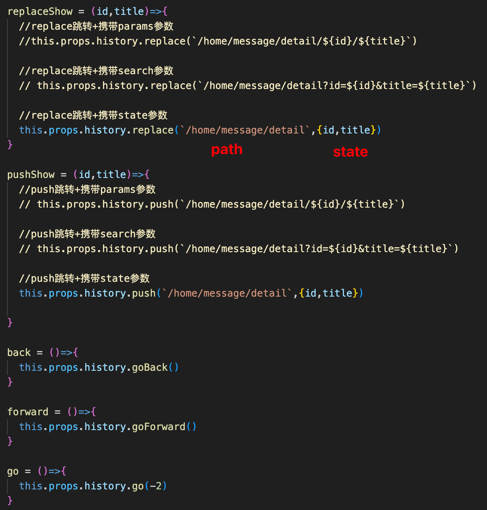
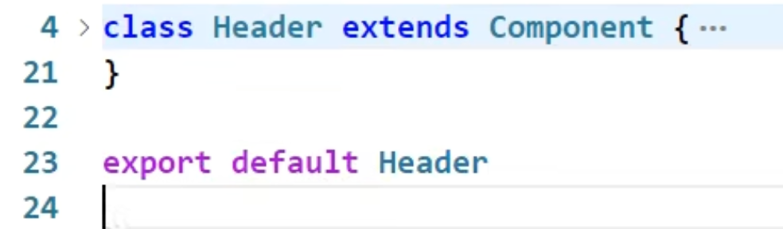
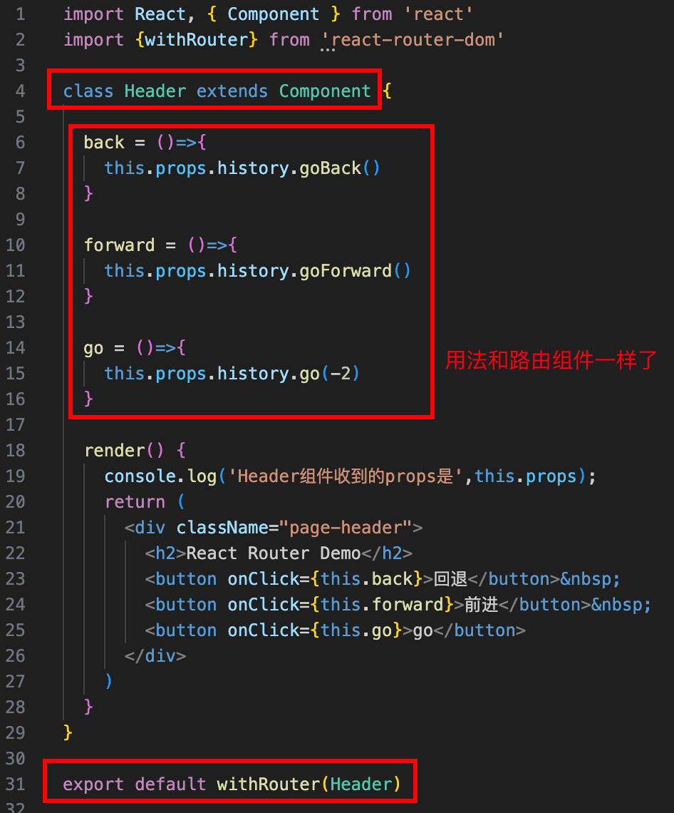

# 1⃣️ React基础

## 01 - 编写示例

```html
<!DOCTYPE html>
<html lang="en">
<head>
	<meta charset="UTF-8">
	<title>hello_react</title>
</head>
<body>
	<!-- 准备好一个“容器” -->
	<div id="test"></div>

	<!-- 引入是要有顺序的 -->
	<!-- 1 引入react核心库 -->
	<script type="text/javascript" src="../js/react.development.js"></script>
	<!-- 2 引入react-dom，用于支持react操作DOM -->
	<script type="text/javascript" src="../js/react-dom.development.js"></script>
	<!-- 3 引入babel，用于将jsx转为js(es6转es5) -->
	<script type="text/javascript" src="../js/babel.min.js"></script>

	<script type="text/babel" > /* 此处一定要写babel，表示这里写的是jsx，并用babel来进行转换，浏览器只看得懂js */
		//1.创建虚拟DOM
		const VDOM = <h1>Hello,React</h1> /* 此处一定不要写引号，因为不是字符串，是虚拟dom，这里是jsx */
		//2.渲染虚拟DOM到页面
		ReactDOM.render(VDOM, document.getElementById('test'))
	</script>
</body>
</html>
```

运行后

浏览器的提示和警告意思👇


**为啥用jsx？👉 jsx解决的是创建虚拟dom太繁琐了的问题**

用jsx：（非常像直接写html标签，语法🍬）

其实还是靠babel翻译成了下面的那种写法浏览器才看得懂，但方便了我们

```js
<script type="text/babel" > /* 此处一定要写babel */
	//1.创建虚拟DOM
	const VDOM = (  /* 此处一定不要写引号，因为不是字符串 */
		<h1 id="title">
			<span>Hello,React</span>
		</h1>
	)
	//2.渲染虚拟DOM到页面
	ReactDOM.render(VDOM,document.getElementById('test'))
</script>
```

用js：

```js
<script type="text/javascript" > 
	//1.创建虚拟DOM
	// React.createElement创建的是虚拟dom，和document.createElement创建的是真实dom
	const VDOM = React.createElement('h1',{id:'title'},React.createElement('span',{},'Hello,React'))
	//2.渲染虚拟DOM到页面
	ReactDOM.render(VDOM,document.getElementById('test'))
</script>
```


## 02 - 虚拟dom和真实dom

关于虚拟DOM：

  1.本质是Object类型的对象（一般对象）

  2.虚拟DOM比较“轻”，真实DOM比较“重”，因为虚拟DOM是React内部在用，无需真实DOM上那么多的属性。

  3.虚拟DOM最终会被React转化为真实DOM，呈现在页面上。


ps：控制台打印出的真实dom是html标签的形式，看不出具体的类型，在console.log后面加一个debugger断点再去浏览器里看


## 03 - jsx语法规则

```js
<script type="text/babel" >
	const myId = 'aTgUiGu'
	const myData = 'HeLlo,rEaCt'

	//1.创建虚拟DOM
	const VDOM = (
		<div>
			<h2 className="title" id={myId.toLowerCase()}>
				<span style={{color:'white',fontSize:'29px'}}>{myData.toLowerCase()}</span>
			</h2>
			<h2 className="title" id={myId.toUpperCase()}>
				<span style={{color:'white',fontSize:'29px'}}>{myData.toLowerCase()}</span>
			</h2>
			<input type="text"/>
		</div>
	)
	//2.渲染虚拟DOM到页面
	ReactDOM.render(VDOM,document.getElementById('test'))

	/* 
			jsx语法规则：
					1.定义虚拟DOM时，不要写引号。
					2.标签中混入JS表达式时要用{}。
					3.样式的类名指定不要用class，要用className。
					4.内联样式，要用style={{key:'value'}}的形式去写。
					5.只有一个根标签
					6.标签必须闭合
					7.标签首字母
							(1).若小写字母开头，则将该标签转为html中同名元素，若html中无该标签对应的同名元素，则报错。
							(2).若大写字母开头，react就去渲染对应的组件，若组件没有定义，则报错。
		*/
</script>
```

**👉 标签中可以混入JS表达式时要用{}，而不是js语句**

一定注意区分：【js语句(代码)】与【js表达式】

​    1.表达式：一个表达式会产生一个值，可以放在任何一个需要值的地方

​          下面这些都是表达式：

​              (1). a

​              (2). a+b

​              (3). demo(1)

​              (4). arr.map() 

​              (5). function test () {}

​    2.语句(代码)：

​          下面这些都是语句(代码)：

​              (1).if(){}

​              (2).for(){}

​              (3).switch(){case:xxxx}


## 04 - 定义组件

### 函数式

```js
<script type="text/babel">
	//1.创建函数式组件
	function MyComponent(){
		console.log(this); // 此处的this是undefined，因为babel编译后开启了严格模式（禁止自定义组件的this指向window）
		return <h2>我是用函数定义的组件(适用于【简单组件】的定义)</h2>
	}
	//2.渲染组件到页面
	ReactDOM.render(<MyComponent/>,document.getElementById('test'))
	/* 
		执行了ReactDOM.render(<MyComponent/>.......之后，发生了什么？
				1.React解析组件标签，找到了MyComponent组件。
				2.发现组件是使用函数定义的，随后调用该函数，将返回的虚拟DOM转为真实DOM，随后呈现在页面中。
	*/
</script>
```

### 类的相关知识

1.类中的构造器不是必须要写的，要对实例进行一些初始化的操作，如添加指定属性时才必须写。

2.如果A类继承了B类，B类需要写到构造器，且A类中写了构造器，那么A类构造器中的super是必须要调用的。

3.类中所定义的方法，都放在了类的原型对象上，供实例去使用。

### 类

```js
<script type="text/babel">
	//1.创建类式组件，去继承React内置的类
	class MyComponent extends React.Component {
		render(){
			//render是放在哪里的？—— MyComponent的原型对象上，供实例使用。
			//render中的this是谁？—— MyComponent的实例对象 <=> MyComponent组件实例对象。
			console.log('render中的this:',this);
			return <h2>我是用类定义的组件(适用于【复杂组件】的定义)</h2>
		}
	}
	//2.渲染组件到页面
	ReactDOM.render(<MyComponent/>,document.getElementById('test'))
	/* 
		执行了ReactDOM.render(<MyComponent/>.......之后，发生了什么？
				1.React解析组件标签，找到了MyComponent组件。
				2.发现组件是使用类定义的，随后new出来该类的实例，并通过该实例调用到原型上的render方法。
				3.将render返回的虚拟DOM转为真实DOM，随后呈现在页面中。
	*/
</script>
```


👉 复杂组件和简单组件的区分

有状态 -> 复杂，无状态 -> 简单


## 05 - 原生事件绑定

```js
<script type="text/javascript" >
  // 1
	const btn1 = document.getElementById('btn1')
	btn1.addEventListener('click',()=>{
		alert('按钮1被点击了')
	})

	// 2
	const btn2 = document.getElementById('btn2')
	btn2.onclick = ()=>{
		alert('按钮2被点击了')
	}

  // 3
	function demo(){
		alert('按钮3被点击了')
	}
</script>
```


## 06 - state

🌟 **类中的方法默认开启了局部的严格模式**

```js
<script type="text/babel">
	//1.创建组件
	class Weather extends React.Component{
		
		//构造器调用几次？ ———— 1次
		constructor(props){
			console.log('constructor');
			super(props)
			//初始化状态
			this.state = {isHot:false,wind:'微风'}
			//解决changeWeather中this指向问题
			this.changeWeather = this.changeWeather.bind(this)
		}

		//render调用几次？ ———— 1+n次 1是初始化的那次 n是状态更新的次数
		render(){
			console.log('render');
			//读取状态
			const {isHot,wind} = this.state
			return <h1 onClick={this.changeWeather}>今天天气很{isHot ? '炎热' : '凉爽'}，{wind}</h1>
		}

		//changeWeather调用几次？ ———— 点几次调几次
		changeWeather(){
			//changeWeather放在哪里？ ———— Weather的原型对象上，供实例使用
      // 🌟 为什么changeWeather中的this为undefined？
			// 1 changeWeather是作为onClick的回调，这样写的话，不是通过实例调用，是直接调用
			// 2 类中的方法默认开启了局部的严格模式
			
			console.log('changeWeather');
			//获取原来的isHot值
			const isHot = this.state.isHot
			// ❗️严重注意：状态必须通过setState进行更新,且更新是一种合并，不是替换。
			this.setState({isHot:!isHot})
			console.log(this);

			//严重注意：状态(state)不可直接更改，下面这行就是直接更改！！！
			//this.state.isHot = !isHot //这是错误的写法
		}
	}
	//2.渲染组件到页面
	ReactDOM.render(<Weather/>,document.getElementById('test'))
			
</script>
```

👉 `this.changeWeather = this.changeWeather.bind(this)` 这句话的作用：

拿到了原型对象上的changeWeather方法，改变这个方法调用的this指向实例对象，从而生成一个新的方法changeWeather，再把它挂载到实例对象上


render里做的事情：

1、从状态里读东西

2、在页面上做展示


👉 简写：

用箭头函数就会去找外面的this，指向的是实例对象

```js
<script type="text/babel">
	//1.创建组件
	class Weather extends React.Component{
		//初始化状态
		state = {isHot:false,wind:'微风'}

		render(){
			const {isHot,wind} = this.state
			return <h1 onClick={this.changeWeather}>今天天气很{isHot ? '炎热' : '凉爽'}，{wind}</h1>
		}

		//自定义方法————要用赋值语句的形式+箭头函数
		changeWeather = () => {
			const isHot = this.state.isHot
			this.setState({isHot:!isHot})
		}
	}
	//2.渲染组件到页面
	ReactDOM.render(<Weather/>,document.getElementById('test'))		
</script>
```


## 07 - props

❗️ 只读不能改

```js
<script type="text/babel">
	//创建组件
	class Person extends React.Component{
		render(){
			// console.log(this);
			const {name,age,sex} = this.props
			return (
				<ul>
					<li>姓名：{name}</li>
					<li>性别：{sex}</li>
					<li>年龄：{age+1}</li>
				</ul>
			)
		}
	}
	//渲染组件到页面
	ReactDOM.render(<Person name="jerry" age={19}  sex="男"/>,document.getElementById('test1'))
	ReactDOM.render(<Person name="tom" age={18} sex="女"/>,document.getElementById('test2'))

	const p = {name:'老刘',age:18,sex:'女'}
	// console.log('@',...p);
	// ReactDOM.render(<Person name={p.name} age={p.age} sex={p.sex}/>,document.getElementById('test3'))
	ReactDOM.render(<Person {...p}/>,document.getElementById('test3'))
</script>
```

👉 这里的 {...p} 不是js中 p2={...p} 复制对象的意思(这是一个新语法)，而是babel+react的情况下，{}代表里面可以放js表达式，并且可以做对象展开，仅在标签属性下可以】
ps：如果只是js的话，{...p}是会报错的(展开运算符不能展开对象)

👉 给prop加上{}就可以传递数字了


引入 - 新增


**对props增加限制：**

```js
<script type="text/babel">
	//创建组件
	class Person extends React.Component{
		render(){
			// console.log(this);
			const {name,age,sex} = this.props
			//props是只读的
			//this.props.name = 'jack' //此行代码会报错，因为props是只读的
			return (
				<ul>
					<li>姓名：{name}</li>
					<li>性别：{sex}</li>
					<li>年龄：{age+1}</li>
				</ul>
			)
		}
	}
	//对标签属性进行类型、必要性的限制
	Person.propTypes = {
		name:PropTypes.string.isRequired, //限制name必传，且为字符串
		sex:PropTypes.string,//限制sex为字符串
		age:PropTypes.number,//限制age为数值
		speak:PropTypes.func,//限制speak为函数
	}
	//指定默认标签属性值
	Person.defaultProps = {
		sex:'男',//sex默认值为男
		age:18 //age默认值为18
	}
	//渲染组件到页面
	ReactDOM.render(<Person name={100} speak={speak}/>,document.getElementById('test1'))
	ReactDOM.render(<Person name="tom" age={18} sex="女"/>,document.getElementById('test2'))

	const p = {name:'老刘',age:18,sex:'女'}
	// console.log('@',...p);
	// ReactDOM.render(<Person name={p.name} age={p.age} sex={p.sex}/>,document.getElementById('test3'))
	ReactDOM.render(<Person {...p}/>,document.getElementById('test3'))

	function speak(){
		console.log('我说话了');
	}
</script>
```


加上 `static`，属性就不加给类的实例对象，而是加给类本身了

👉 简写：

```js
<script type="text/babel">
	//创建组件
	class Person extends React.Component{

		constructor(props){
			//构造器是否接收props，是否传递给super，取决于：是否希望在构造器中通过this访问props
			// console.log(props);
			super(props)
			console.log('constructor',this.props);
		}

		//✅ 对标签属性进行类型、必要性的限制
		static propTypes = {
			name:PropTypes.string.isRequired, //限制name必传，且为字符串
			sex:PropTypes.string,//限制sex为字符串
			age:PropTypes.number,//限制age为数值
		}

		//✅ 指定默认标签属性值
		static defaultProps = {
			sex:'男',//sex默认值为男
			age:18 //age默认值为18
		}
		
		render(){
			// console.log(this);
			const {name,age,sex} = this.props
			//props是只读的
			//this.props.name = 'jack' //此行代码会报错，因为props是只读的
			return (
				<ul>
					<li>姓名：{name}</li>
					<li>性别：{sex}</li>
					<li>年龄：{age+1}</li>
				</ul>
			)
		}
	}

	//渲染组件到页面
	ReactDOM.render(<Person name="jerry"/>,document.getElementById('test1'))
</script>
```


🙆‍♂️ 总结一下：


1、constructor构造函数可以不传，上图中仅用于的两种情况都可以用其余方式解决

- 直接给state赋值
- 赋值语句+箭头函数

2、写了constructor构造函数必须里面加上super，并且super中写上props，否则会出现图中的问题

👉 **构造器是否接收props，是否传递给super，取决于：是否希望在构造器中通过this访问props**，这种情况几乎没有，所以开发中都不写


**函数式组件使用props：**

```js
<script type="text/babel">
	//创建组件
	function Person (props){
		const {name,age,sex} = props
		return (
				<ul>
					<li>姓名：{name}</li>
					<li>性别：{sex}</li>
					<li>年龄：{age}</li>
				</ul>
			)
	}
	Person.propTypes = {
		name:PropTypes.string.isRequired, //限制name必传，且为字符串
		sex:PropTypes.string,//限制sex为字符串
		age:PropTypes.number,//限制age为数值
	}
	//指定默认标签属性值
	Person.defaultProps = {
		sex:'男',//sex默认值为男
		age:18 //age默认值为18
	}
	//渲染组件到页面
	ReactDOM.render(<Person name="jerry"/>,document.getElementById('test1'))
</script>
```


## 08 - refs

### 1 字符串（不推荐）

官方不推荐，效率不高，但确实方便，16.x的都还在用

```js
<script type="text/babel">
	//创建组件
	class Demo extends React.Component{
		//展示左侧输入框的数据
		showData = ()=>{
			const {input1} = this.refs
			alert(input1.value)
		}
		//展示右侧输入框的数据
		showData2 = ()=>{
			const {input2} = this.refs
			alert(input2.value)
		}
		render(){
			return(
				<div>
					<input ref="input1" type="text" placeholder="点击按钮提示数据"/>&nbsp;
					<button onClick={this.showData}>点我提示左侧的数据</button>&nbsp;
					<input ref="input2" onBlur={this.showData2} type="text" placeholder="失去焦点提示数据"/>
				</div>
			)
		}
	}
	//渲染组件到页面
	ReactDOM.render(<Demo a="1" b="2"/>,document.getElementById('test'))
</script>
```

### 2 回调函数（用内联）

回调函数直白来说：

- 你定义的函数
- 你没调用
- 这个函数最终执行了

取名ref后，react会帮你调用的，还把ref当前所处节点传进去了

```js
<script type="text/babel">
	//创建组件
	class Demo extends React.Component{
		//展示左侧输入框的数据
		showData = ()=>{
			const {input1} = this
			alert(input1.value)
		}
		//展示右侧输入框的数据
		showData2 = ()=>{
			const {input2} = this
			alert(input2.value)
		}
		render(){
			return(
				<div>
					// 拿到节点c(currentNode)，把这个节点放在了组件实例对象自身上，并取名input1
					<input ref={c => this.input1 = c } type="text" placeholder="点击按钮提示数据"/>&nbsp;
					<button onClick={this.showData}>点我提示左侧的数据</button>&nbsp;
					<input onBlur={this.showData2} ref={c => this.input2 = c } type="text" placeholder="失去焦点提示数据"/>&nbsp;
				</div>
			)
		}
	}
	//渲染组件到页面
	ReactDOM.render(<Demo a="1" b="2"/>,document.getElementById('test'))
</script>
```

👉 关于回调ref中回调执行次数的问题：


class绑定函数的意思是，给它拎出来个函数的感觉

每次更新都会重新调一次render，发现你写了ref，ref中的回调函数是一个新的函数，所以需要先清空旧的（置为null），再去设置新的

定义成**类绑定函数**方式 -> 它就知道每次渲染的函数是一样的了

真是开发中直接写内联就行了，这种差别无关紧要

```js
<script type="text/babel">
	//创建组件
	class Demo extends React.Component{

		state = {isHot:false}

		showInfo = ()=>{
			const {input1} = this
			alert(input1.value)
		}

		changeWeather = ()=>{
			//获取原来的状态
			const {isHot} = this.state
			//更新状态
			this.setState({isHot:!isHot})
		}

		saveInput = (c)=>{
			this.input1 = c;
			console.log('@',c);
		}

		render(){
			const {isHot} = this.state
			return(
				<div>
					<h2>今天天气很{isHot ? '炎热':'凉爽'}</h2>
					{/* <input ref={(c)=>{this.input1 = c;console.log('@',c);}} type="text"/><br/><br/> */}
					<input ref={this.saveInput} type="text"/><br/><br/>
					<button onClick={this.showInfo}>点我提示输入的数据</button>
					<button onClick={this.changeWeather}>点我切换天气</button>
				</div>
			)
		}
	}
	//渲染组件到页面
	ReactDOM.render(<Demo/>,document.getElementById('test'))
</script>
```


### 3 createRef（最推荐）

myRef 是通过createRef创建出来的一个容器，会把ref所在的节点放到容器里

```js
<script type="text/babel">
	//创建组件
	class Demo extends React.Component{
		/* 
			React.createRef调用后可以返回一个容器，该容器可以存储被ref所标识的节点,该容器是“专人专用”的
			*/
		myRef = React.createRef()
		myRef2 = React.createRef()
		//展示左侧输入框的数据
		showData = ()=>{
			alert(this.myRef.current.value);
		}
		//展示右侧输入框的数据
		showData2 = ()=>{
			alert(this.myRef2.current.value);
		}
		render(){
			return(
				<div>
					{/* myRef 是通过createRef创建出来的一个容器，会把ref所在的节点放到容器里 */}
					<input ref={this.myRef} type="text" placeholder="点击按钮提示数据"/>&nbsp;
					<button onClick={this.showData}>点我提示左侧的数据</button>&nbsp;
					<input onBlur={this.showData2} ref={this.myRef2} type="text" placeholder="失去焦点提示数据"/>&nbsp;
				</div>
			)
		}
	}
	//渲染组件到页面
	ReactDOM.render(<Demo a="1" b="2"/>,document.getElementById('test'))
</script>
```


## 09 - 事件处理

(1).通过onXxx属性指定事件处理函数(注意大小写)

​    a.React使用的是自定义(合成)事件, 而不是使用的原生DOM事件 ————————为了更好的兼容性

​    b.React中的事件是通过事件委托方式处理的(委托给组件最外层的元素) ————————为了的高效

(2).通过event.target得到发生事件的DOM元素对象 ————————不要过度使用ref【发生事件的元素正好是要操作的元素，就可以省略ref，用event.target拿】


## 10 - 受控？

非受控：现用现取

```js
<script type="text/babel">
	//创建组件
	class Login extends React.Component{
		handleSubmit = (event)=>{
			event.preventDefault() //阻止表单提交
			const {username,password} = this
			alert(`你输入的用户名是：${username.value},你输入的密码是：${password.value}`)
		}
		render(){
			return(
				<form onSubmit={this.handleSubmit}>
					用户名：<input ref={c => this.username = c} type="text" name="username"/>
					密码：<input ref={c => this.password = c} type="password" name="password"/>
					<button>登录</button>
				</form>
			)
		}
	}
	//渲染组件
	ReactDOM.render(<Login/>,document.getElementById('test'))
</script>
```

受控：随着输入维护状态，有点像vue的双向数据绑定（v-model就是v-bind + @change的语法糖）【推荐（省略ref）】

```js
<script type="text/babel">
	//创建组件
	class Login extends React.Component{

		//初始化状态
		state = {
			username:'', //用户名
			password:'' //密码
		}

		//保存用户名到状态中
		saveUsername = (event)=>{
			this.setState({username:event.target.value})
		}

		//保存密码到状态中
		savePassword = (event)=>{
			this.setState({password:event.target.value})
		}

		//表单提交的回调
		handleSubmit = (event)=>{
			event.preventDefault() //阻止表单提交
			const {username,password} = this.state
			alert(`你输入的用户名是：${username},你输入的密码是：${password}`)
		}

		render(){
			return(
				<form onSubmit={this.handleSubmit}>
					用户名：<input onChange={this.saveUsername} type="text" name="username"/>
					密码：<input onChange={this.savePassword} type="password" name="password"/>
					<button>登录</button>
				</form>
			)
		}
	}
	//渲染组件
	ReactDOM.render(<Login/>,document.getElementById('test'))
</script>
```


## 12 - 高阶函数 柯里化

**高阶函数：**如果一个函数符合下面2个规范中的任何一个，那该函数就是高阶函数。

​        1.若A函数，接收的参数是一个函数，那么A就可以称之为高阶函数。

​        2.若A函数，调用的返回值依然是一个函数，那么A就可以称之为高阶函数。

​        常见的高阶函数有：Promise、setTimeout、arr.map()等等

**函数的柯里化：**通过函数调用继续返回函数的方式，实现多次接收参数最后统一处理的函数编码形式。 

```js
function sum(a){
	return(b)=>{
		return (c)=>{
			return a+b+c
		}
	}
}
```

```js
<script type="text/babel">
	//创建组件
	class Login extends React.Component{
		//初始化状态
		state = {
			username:'', //用户名
			password:'' //密码
		}

		//保存表单数据到状态中
		saveFormData = (dataType)=>{
			return (event)=>{
				this.setState({[dataType]:event.target.value})
			}
		}

		//表单提交的回调
		handleSubmit = (event)=>{
			event.preventDefault() //阻止表单提交
			const {username,password} = this.state
			alert(`你输入的用户名是：${username},你输入的密码是：${password}`)
		}
		render(){
			return(
				<form onSubmit={this.handleSubmit}>
					用户名：<input onChange={this.saveFormData('username')} type="text" name="username"/>
					密码：<input onChange={this.saveFormData('password')} type="password" name="password"/>
					<button>登录</button>
				</form>
			)
		}
	}
	//渲染组件
	ReactDOM.render(<Login/>,document.getElementById('test'))
</script>
```

这里的saveFormData函数实际上就是高阶函数，并运用了柯里化

`用户名：<input onChange={event => this.saveFormData('username',event) } type="text" name="username"/>` 变成这种也ok，不用柯里化和高阶函数，以前我都这么写的诶


## 13 - 生命周期

### 1 引入


这个警告还真挺常见的，之前遇到好像就没管诶😂

不能再已被卸载的组件上执行状态的更新 👉 在组件要被卸载之前的生命周期函数中，销毁掉定时器

生命周期回调函数 <=> 生命周期钩子函数 <=> 生命周期函数 <=> 生命周期钩子

### 2 旧


```js
<script type="text/babel">
	/* 
			1. 初始化阶段: 由ReactDOM.render()触发---初次渲染
								1.	constructor()
								2.	componentWillMount()
								3.	render()
								4.	componentDidMount() =====> 常用
												一般在这个钩子中做一些初始化的事，例如：开启定时器、发送网络请求、订阅消息
			2. 更新阶段: 由组件内部this.setSate()或父组件render触发
								1.	shouldComponentUpdate()
								2.	componentWillUpdate()
								3.	render() =====> 必须使用的一个
								4.	componentDidUpdate()
			3. 卸载组件: 由ReactDOM.unmountComponentAtNode()触发
								1.	componentWillUnmount()  =====> 常用
												一般在这个钩子中做一些收尾的事，例如：关闭定时器、取消订阅消息
	*/
	//创建组件
	class Count extends React.Component{

		//构造器
		constructor(props){
			console.log('Count---constructor');
			super(props)
			//初始化状态
			this.state = {count:0}
		}

		//加1按钮的回调
		add = ()=>{
			//获取原状态
			const {count} = this.state
			//更新状态
			this.setState({count:count+1})
		}

		//卸载组件按钮的回调
		death = ()=>{
			ReactDOM.unmountComponentAtNode(document.getElementById('test'))
		}

		//强制更新按钮的回调
		force = ()=>{
			this.forceUpdate()
		}

		//组件将要挂载的钩子
		componentWillMount(){
			console.log('Count---componentWillMount');
		}

		//组件挂载完毕的钩子
		componentDidMount(){
			console.log('Count---componentDidMount');
		}

		//组件将要卸载的钩子
		componentWillUnmount(){
			console.log('Count---componentWillUnmount');
		}

		//控制组件更新的“阀门”
		shouldComponentUpdate(){
			console.log('Count---shouldComponentUpdate');
			return true
		}

		//组件将要更新的钩子
		componentWillUpdate(){
			console.log('Count---componentWillUpdate');
		}

		//组件更新完毕的钩子
		componentDidUpdate(){
			console.log('Count---componentDidUpdate');
		}

		render(){
			console.log('Count---render');
			const {count} = this.state
			return(
				<div>
					<h2>当前求和为：{count}</h2>
					<button onClick={this.add}>点我+1</button>
					<button onClick={this.death}>卸载组件</button>
					<button onClick={this.force}>不更改任何状态中的数据，强制更新一下</button>
				</div>
			)
		}
	}
	
	//父组件A
	class A extends React.Component{
		//初始化状态
		state = {carName:'奔驰'}

		changeCar = ()=>{
			this.setState({carName:'奥拓'})
		}

		render(){
			return(
				<div>
					<div>我是A组件</div>
					<button onClick={this.changeCar}>换车</button>
					<B carName={this.state.carName}/>
				</div>
			)
		}
	}
	
	//子组件B
	class B extends React.Component{
		//组件将要接收新的props的钩子(第一次不算)
		componentWillReceiveProps(props){
			console.log('B---componentWillReceiveProps',props);
		}

		//控制组件更新的“阀门”
		shouldComponentUpdate(){
			console.log('B---shouldComponentUpdate');
			return true
		}
		//组件将要更新的钩子
		componentWillUpdate(){
			console.log('B---componentWillUpdate');
		}

		//组件更新完毕的钩子
		componentDidUpdate(){
			console.log('B---componentDidUpdate');
		}

		render(){
			console.log('B---render');
			return(
				<div>我是B组件，接收到的车是:{this.props.carName}</div>
			)
		}
	}
	
	//渲染组件
	ReactDOM.render(<Count/>,document.getElementById('test'))
	ReactDOM.render(<A/>,document.getElementById('test'))
</script>
```

### 3 新

所有带will的钩子都需要加上UNSAFE_，除了componentWIllUnmount

**新旧对比：**废弃了3个，新增了两个（用的场景也极为罕见）


```js
<script type="text/babel">
	//创建组件
	class Count extends React.Component{
		/* 
			1. 初始化阶段: 由ReactDOM.render()触发---初次渲染
							1.	constructor()
							2.	getDerivedStateFromProps 
							3.	render()
							4.	componentDidMount() =====> 常用
										一般在这个钩子中做一些初始化的事，例如：开启定时器、发送网络请求、订阅消息
			2. 更新阶段: 由组件内部this.setSate()或父组件重新render触发
							1.	getDerivedStateFromProps
							2.	shouldComponentUpdate()
							3.	render()
							4.	getSnapshotBeforeUpdate
							5.	componentDidUpdate()
			3. 卸载组件: 由ReactDOM.unmountComponentAtNode()触发
							1.	componentWillUnmount()  =====> 常用
										一般在这个钩子中做一些收尾的事，例如：关闭定时器、取消订阅消息
		*/
		//构造器
		constructor(props){
			console.log('Count---constructor');
			super(props)
			//初始化状态
			this.state = {count:0}
		}

		//加1按钮的回调
		add = ()=>{
			//获取原状态
			const {count} = this.state
			//更新状态
			this.setState({count:count+1})
		}

		//卸载组件按钮的回调
		death = ()=>{
			ReactDOM.unmountComponentAtNode(document.getElementById('test'))
		}

		//强制更新按钮的回调
		force = ()=>{
			this.forceUpdate()
		}
		
		//若state的值在任何时候都取决于props，那么可以使用getDerivedStateFromProps
		static getDerivedStateFromProps(props,state){
			console.log('getDerivedStateFromProps',props,state);
			return null
		}

		//在更新之前获取快照
		getSnapshotBeforeUpdate(){
			console.log('getSnapshotBeforeUpdate');
			return 'atguigu'
		}

		//组件挂载完毕的钩子
		componentDidMount(){
			console.log('Count---componentDidMount');
		}

		//组件将要卸载的钩子
		componentWillUnmount(){
			console.log('Count---componentWillUnmount');
		}

		//控制组件更新的“阀门”
		shouldComponentUpdate(){
			console.log('Count---shouldComponentUpdate');
			return true
		}

		//组件更新完毕的钩子
		componentDidUpdate(preProps,preState,snapshotValue){
			console.log('Count---componentDidUpdate',preProps,preState,snapshotValue);
		}
		
		render(){
			console.log('Count---render');
			const {count} = this.state
			return(
				<div>
					<h2>当前求和为：{count}</h2>
					<button onClick={this.add}>点我+1</button>
					<button onClick={this.death}>卸载组件</button>
					<button onClick={this.force}>不更改任何状态中的数据，强制更新一下</button>
				</div>
			)
		}
	}
	
	//渲染组件
	ReactDOM.render(<Count count={199}/>,document.getElementById('test'))
</script>
```

**static getDerivedStateFromProps** 可以对比props和state，当xxx情况下选择return谁，就会以谁为主

返回null就无影响

**getSnapshotBeforeUpdate** return的东西叫快照，它会作为componentDidUpdate的第三个参数，就相当于记录了一下组建更新之前的东西（eg：当前浏览器的视口宽度、之前列表的高度等），看你想传啥都行

【这两个钩子的用途都很罕见，但第二个比第一个有意义一点】

getSnapshotBeforeUpdate 案例👇

```js
<script type="text/babel">
	class NewsList extends React.Component{

		state = {newsArr:[]}

		componentDidMount(){
			setInterval(() => {
				//获取原状态
				const {newsArr} = this.state
				//模拟一条新闻
				const news = '新闻'+ (newsArr.length+1)
				//更新状态
				this.setState({newsArr:[news,...newsArr]})
			}, 1000);
		}

		getSnapshotBeforeUpdate(){
			return this.refs.list.scrollHeight
		}

		componentDidUpdate(preProps,preState,height){
			this.refs.list.scrollTop += this.refs.list.scrollHeight - height
		}

		render(){
			return(
				<div className="list" ref="list">
					{
						this.state.newsArr.map((n,index)=>{
							return <div key={index} className="news">{n}</div>
						})
					}
				</div>
			)
		}
	}
	ReactDOM.render(<NewsList/>,document.getElementById('test'))
</script>
```

最常用的钩子没变，废弃三个，新增的也不常用，需要特殊的场景


## 14 - dom的diffing

对比的最小粒度是标签，只有标签中的文字变了，更新的也是整个标签。但这里也是逐层对比（递归），不会外部标签改了，内部标签没变也更新


### key的作用

虚拟dom没有value值

经典面试题:
  1). react/vue中的key有什么作用？（key的内部原理是什么？）
  2). 为什么遍历列表时，key最好不要用index?

  1. **虚拟DOM中key的作用**：
      1). 简单的说: key是虚拟DOM对象的标识, 在更新显示时key起着极其重要的作用。

      2). 详细的说: 当状态中的数据发生变化时，react会根据【新数据】生成【新的虚拟DOM】, 
                    随后React进行【新虚拟DOM】与【旧虚拟DOM】的diff比较，比较规则如下：

      ​        a. 旧虚拟DOM中找到了与新虚拟DOM相同的key：
      ​              (1).若虚拟DOM中内容没变, 直接使用之前的真实DOM
      ​              (2).若虚拟DOM中内容变了, 则生成新的真实DOM，随后替换掉页面中之前的真实DOM

      ​        b. 旧虚拟DOM中未找到与新虚拟DOM相同的key
      ​              根据数据创建新的真实DOM，随后渲染到到页面
      
  2. **用index作为key可能会引发的问题**：
          
            1. 若对数据进行：逆序添加、逆序删除等破坏顺序操作:
                会产生没有必要的真实DOM更新 ==> 界面效果没问题, 但效率低。
          
            2. 如果结构中还包含输入类的DOM：
                    会产生错误DOM更新 ==> 界面有问题。
                  
            3. 注意！如果不存在对数据的逆序添加、逆序删除等破坏顺序操作，
          
          仅用于渲染列表用于展示，使用index作为key是没有问题的。
      
  3. 开发中如何选择key?:
            1.最好使用每条数据的唯一标识作为key, 比如id、手机号、身份证号、学号等唯一值。而且不用慌，后端肯定会提供唯一标识，供删除之类的操作
            2.如果确定只是简单的展示数据，用index也是可以的。


# 2⃣️ 脚手架

## 01 - 文件用途

public -------- 静态文件

​	favicon.ico -------- 网页图标

​	index.html -------- 装各个组件的页面（SPA单页面应用）【最有用的，东西都往<div id="root"></div>里放】✅

​	mainest.json -------- 做应用加壳时，app对于一些需要权限的配置【应用加壳 就可以变成一个app应用】

​	robots.txt -------- 爬虫规则文件，可以规定爬虫在爬取页面时，什么能爬取，什么不能爬取

src

​	app.js -------- 组件，react脚手架会执行reactDom.render把app组件放到index.html文件的<div id="root"></div>里✅

​	index.css -------- 通用样式

​	index.js -------- 入口文件，引入react核心库、reactDom、通用样式、app组件（index.js和index.html之间的绑定是通过react的webpack写好的）✅

​		<React.StrictMode></React.StrictMode> 可以检查app包裹的东西里的代码是否合理

​		

​	reportWebVitals.js -------- 记录页面性能，用上了'web-vitals'库，这个很庞大，有很多配置

​	setupTests.js -------- 做整体、组件测试，引用了jest-dom库


​	

## 02 - import 和 export

App.js

```js
// 创建“外壳”组件App
import React from 'react'
class App extends React.Component {
  render() {
    return (
      <div>
      	hello,react!
      </div>
    )
  }
}

// 暴露App组件
export default App
```

1 可以这么写

App.js

```js
// 创建“外壳”组件App
import React from 'react'
import { Component } from React 📍
class App extends Component { 📍
  render() {
    return (
      <div>
      	hello,react!
      </div>
    )
  }
}

// 暴露App组件
export default App
```

2 还可以这么写

App.js

```js
// 创建“外壳”组件App
import React, { Componet } from 'react' 📍 // 这不是解构赋值
class App extends Component { 📍
  render() {
    return (
      <div>
      	hello,react!
      </div>
    )
  }
}

// 暴露App组件
export default App
```

3 再简写一下 ✅

App.js

```js
// 创建“外壳”组件App
import React, { Componet } from 'react' 📍 // 这不是解构赋值
export default class App extends Component { 📍
  render() {
    return (
      <div>
      	hello,react!
      </div>
    )
  }
}
```

👇 `import React, { Componet } from 'react'` 解析 - 来个例子

新建一个模块文件 moudule.js 和 index.js

moudule.js

```js
const React = { a: 1, b: 2 }
React.Component = class Component {
  
}
export default React
```

index.js

```js
import React from './module.js'
console.log(React) // { a: 1, b: 2, Component: f }
// 使用这个类
const { Component } = React // 这个是解构赋值
console.log(new Component()) // Component{}类的实例对象
```

1 测试是否能使用{ Component }直接来解构赋值 ------ ✖️

index.js

```js
import React, { Component } from './module.js' 📍
console.log(React) // { a: 1, b: 2, Component: f }
// 使用这个类
console.log(new Component()) // Component{}类的实例对象
```

2 想用1中的写法 moudule.js 文件的改法

moudule.js

```js
const React = { a: 1, b: 2 }
export class Component { 📍 // 分别暴露
  
}
React.Component = Component
export default React 📍 // 默认暴露
```

🌟 综上`import React, { Componet } from 'react'` 这种引入方式的意味着'react'中用了多种暴露形式


### 省略后缀

react脚手架里，引入js和jsx都是可以省略后缀的

app.js 一般不改jsx


## 03 - 样式隔离

把css文件前面加上module

import styles from './index.module.css'

标签中 className={styles.xxx}

😲 原来之前react项目中用这种是为了做样式隔离啊，用less嵌套的话，就可以不这么写


代码片段

https://github.com/r5n-dev/vscode-react-javascript-snippets/blob/HEAD/docs/Snippets.md

rcc - reactClassComponent

rfc - reactFunctionComponent


## 04 - todolist

1 用展开运算符传props


2 绑定事件的元素和要操作的元素相同 -> 用event.target（理解一下这里是什么意思 👉 这边是需要把点击enter键触发的事件绑定给input标签，并且同时要去拿到input的value值）

3 拿键盘按键是否是回车键：event.key==='Enter'（keyCode已经要废弃了）

4 nanoid和uuid一样，但这个库很小

5 绑定函数加上小括号之后，在函数定义的时候要返回箭头函数


或者改成这种


6 状态提升：把数据放在某些组件共同的父组件state中

7 defaultChecked：只执行一次，后面就不更改了，checked：配合onChange使用


## 05 - 脚手架配置代理

产生跨域的本质是ajax引擎

中间的代理服务器是开在client端的，它没有ajax引擎，是转发请求的，所以不会出现跨域问题

改了package.json文件后，必须重启项目才奏效

### 1 配置一个代理

> 在package.json中追加如下配置

```json
"proxy":"http://localhost:5000"
```

说明：

1. 优点：配置简单，前端请求资源时可以不加任何前缀。
2. 缺点：不能配置多个代理。
3. 工作方式：上述方式配置代理，当请求了3000不存在的资源时，那么该请求会转发给5000 （优先匹配前端资源）

package.json 👉 配置了proxy，不是所有请求都转发的，是要3000端口没有的，才转发给5000【配置一个代理】


App.jsx 请求发送给代理服务器


### 2 配置多个代理

1. 第一步：创建代理配置文件，react脚手架会去找到这个文件的

   ```
   在src下创建配置文件：src/setupProxy.js
   ```

2. 编写setupProxy.js配置具体代理规则：【用commonjs的语法】

   http-proxy-middleware 1.x 版本后用 `const { createProxyMiddleware } = require('http-proxy-middleware');`

   ```js
   const { createProxyMiddleware } = require('http-proxy-middleware')
   
   module.exports = function(app) {
     app.use(
       createProxyMiddleware('/api1', {  //api1是需要转发的请求(所有带有/api1前缀的请求都会转发给5000)
         target: 'http://localhost:5000', //配置转发目标地址(能返回数据的服务器地址)
         changeOrigin: true, //控制服务器收到的请求头中Host的值，如果不加，服务器还是可以知道请求真实来自于哪里，如果服务器有其他限制就会有影响，发现前端这边在欺骗它
         /*
         	changeOrigin设置为true时，服务器收到的请求头中的host为：localhost:5000
         	changeOrigin设置为false时，服务器收到的请求头中的host为：localhost:3000
         	changeOrigin默认值为false，但我们一般将changeOrigin值设为true
         */
         pathRewrite: {'^/api1': ''} //去除请求前缀，保证交给后台服务器的是正常请求地址(必须配置)
       }),
       createProxyMiddleware('/api2', { 
         target: 'http://localhost:5001',
         changeOrigin: true,
         pathRewrite: {'^/api2': ''}
       })
     )
   }
   ```

说明：

1. 优点：可以配置多个代理，可以灵活的控制请求是否走代理。
2. 缺点：配置繁琐，前端请求资源时必须加前缀。

服务器拿到host值


# 3⃣️ 搜索案例

### 连续解构赋值

但是这样不能单独拿出a、b，会显示undefined


重命名


## 01 - 发布订阅

### 参数占位

PubSub.subscribe的第二个参数是个函数，这个函数有两个参数分别是msg和data，但是msg用不到，这种情况下就用`_`来占个位置


用法：https://github.com/mroderick/PubSubJS

subscribe

publish

unsubscribe


## 02 - fetch

**fetch发请求没有用到xhr，但是浏览器兼容性一般，所以也可能不怎么用**

**axios和jquery都是对xhr的封装**

window自带，不用安装

👇 下面这张图

1 不加红框这句话：当断网时，会走连接服务器失败这句话，返回值时undefined，所以还会往下走，显示获取数据失败

2 加红框这句话：我们不希望显示获取数据失败，而是**中断promise链，返回一个初始化状态的promise实例**❗️


👇 优化


👇 优化

用上await和trycatch

Emm 最外面的search函数应该要改成 `search = async () => {}`这样的，await得放在async里，不知道为什么视频这里不加async还没报错😵‍💫


## 03 - 搜索案例总结

1.设计状态时要考虑全面，例如带有网络请求的组件，要考虑请求失败怎么办。

2.ES6小知识点：解构赋值+重命名

​      let obj = {a:{b:1}}

​      const {a} = obj; //传统解构赋值

​      const {a:{b}} = obj; //连续解构赋值

​      const {a:{b:value}} = obj; //连续解构赋值+重命名

3.消息订阅与发布机制

​      1.先订阅，再发布（理解：有一种隔空对话的感觉）

​      2.适用于任意组件间通信

​      3.要在组件的componentWillUnmount中取消订阅

4.fetch发送请求（关注分离的设计思想）

​      try {

​        const response= await fetch(`/api1/search/users2?q=${keyWord}`)

​        const data = await response.json()

​        console.log(data);

​      } catch (error) {

​        console.log('请求出错',error);

​      }


# 4⃣️ 路由

### 01 - 前端路由原理

**1.** 什么是路由

1. 一个路由就是一个映射关系(key:value)
2. **key为路径, value可能是function或component**

**2.** 路由分类

1. 后端路由：

   理解： value是function, 用来处理客户端提交的请求。

   注册路由： router.get(path, function(req, res))

   工作过程：当node接收到一个请求时, 根据请求路径找到匹配的路由, 调用路由中的函数来处理请求, 返回响应数据

   

2. 前端路由：

   浏览器端路由，value是component，用于展示页面内容。

   注册路由: <Route path="/test" component={Test}>

   工作过程：当浏览器的path变为/test时, 当前路由组件就会变为Test组件


都是建立在BOM的history的基础上的


### 02 - push VS replace

路由是一个栈结构

push 就是往栈顶上加，back的时候栈顶元素先出

replace是把栈顶元素直接替换成新的元素


### 03 - react-router

分为三种

- web（react-router-dom）
- native
- any


### 04 - 路由的基本使用

1.明确好界面中的导航区、展示区

2.导航区的a标签改为Link标签

​      <Link to="/xxxxx">Demo</Link>

3.展示区写Route标签进行路径的匹配

​      <Route path='/xxxx' component={Demo}/>

4.<App>的最外侧包裹了一个<BrowserRouter>或<HashRouter>


### 05 - 路由组件与一般组件

1.写法不同：

  一般组件：<Demo/>

  路由组件：<Route path="/demo" component={Demo}/>

2.存放位置不同：

  一般组件：components

  路由组件：pages

3.接收到的props不同：

  一般组件：写组件标签时传递了什么，就能收到什么

  路由组件：接收到三个固定的属性

- history:

​            go: ƒ go(n)

​            goBack: ƒ goBack()

​            goForward: ƒ goForward()

​            push: ƒ push(path, state)

​            replace: ƒ replace(path, state)

- location:

​            pathname: "/about"

​            search: ""

​            state: undefined

- match:

​            params: {}

​            path: "/about"

​            url: "/about"


### 04 - 一些内置组件

#### Link（🈚️高亮）

一般路由


#### NavLink（🈶️高亮）

1.NavLink可以实现路由链接的高亮，通过activeClassName指定样式名，默认是选中添加active的类名

2.标签体内容是一个特殊的标签属性，不用放在开始标签和结束标签中间，再用this.props.children拿到，直接可以放在一个单标签中，用children属性传入

**封装MyNavLink：**

App.jsx


MyNavLink.jsx


#### Switch(改成了routes)

1.通常情况下，path和component是一一对应的关系。

2.Switch可以提高路由匹配效率(单一匹配)。


### 05 - 解决多级路径刷新页面样式丢失的问题

emm 新版的解决了这个问题，问题产生是因为请求bootstrap的路径不对，请求的路径都改成以下这种后，请求css的路径中也会莫名其妙加上/atguigu


找不到的话，会默认返回index.html


**解决方案：**

1.public/index.html 中 引入样式时不写 ./ 写 / （常用）

2.public/index.html 中 引入样式时不写 ./ 写 %PUBLIC_URL% （常用）

3.使用HashRouter（因为hash路由发送网络请求时，不会带#后面的东西）


### 06 - 严格匹配与模糊匹配

1.默认使用的是模糊匹配（简单记：【输入的路径】必须包含要【匹配的路径】，且顺序要一致）

2.开启严格匹配：<Route exact path="/about" component={About}/>

3.严格匹配不要随便开启，需要再开，有些时候开启会导致无法继续匹配二级路由


### 07 - 一些内置组件

#### Redirect

1.一般写在所有路由注册的最下方，当所有路由都无法匹配时，跳转到Redirect指定的路由
2.具体编码：
    <Switch>
      <Route path="/about" component={About}/>
      <Route path="/home" component={Home}/>
      <Redirect to="/about"/>
    </Switch>


### 08 - 嵌套路由

1.注册子路由时要写上父路由的path值

2.路由的匹配是按照注册路由的顺序进行的

3.不能开启严格匹配


👉 V6改了，一级注册路由在path后面加/*，二级注册路由path只用写子路由


### 09 - 向路由组件传递参数

#### params

✅ 用得最多

路由链接(携带参数)：<Link to='/demo/test/tom/18'}>详情</Link>

注册路由(声明接收)：<Route path="/demo/test/:name/:age" component={Test}/> ❗️只有这种需要声明接受

接收参数：this.props.match.params


this.props 打印的内容


#### search（query形式）

✅ 需要解析

路由链接(携带参数)：<Link to='/demo/test?name=tom&age=18'}>详情</Link>

注册路由(无需声明，正常注册即可)：<Route path="/demo/test" component={Test}/>

接收参数：this.props.location.search

备注：获取到的search是**urlencoded编码字符串**，需要借助querystring解析


现在是import qs from 'qs'，querystringfy弃用了


#### state

✅ 不想用户知道传了什么参数

👉 Link的to属性需要传一个对象，路径中不带任何参数，不是组件中的state

路由链接(携带参数)：<Link to={{pathname:'/demo/test',state:{name:'tom',age:18}}}>详情</Link>

注册路由(无需声明，正常注册即可)：<Route path="/demo/test" component={Test}/>

接收参数：this.props.location.state

备注：刷新也可以保留住参数（HashRouter会丢）


### 10 - push 🆚 replace模式

默认都是push模式


👉 应用场景：登录成功的时候需要开启replace，不用退回去了，你已经登录成功了，就进入首页

如果所有路由都开启replace模式，就意味着回退按钮一直灰着了


### 11 - this.prosp.history对象上的API

操作路由跳转、前进、后退

​    -this.prosp.history.push(path, state)

​    -this.prosp.history.replace(path, state)

​    -this.prosp.history.goBack()

​    -this.prosp.history.goForward()

​    -this.prosp.history.go(n) 正数前进n，负数后退n




### 12 - withRouter

react 中会区分一般组件和路由组件，所以如果想在一般组件中调用history的api就需要用withRouter这个函数

Vue中不会出现这个问题，因为Vue的实例对象上都有这些api

👉 原来


👉 换一种



👉 用上withRouter


withRouter可以加工一般组件（接收一个一般组件），让一般组件具备路由组件所特有的几个API

withRouter的返回值是一个新组件




### 12 - BrowserRouter与HashRouter的区别

1.底层原理不一样：

​      BrowserRouter使用的是H5的history API（react中的this.props.history也是二次封装了这个history），不兼容IE9及以下版本。

​      HashRouter使用的是URL的哈希值（#后面的东西都不会发送给服务器）。

2.path表现形式不一样

​      BrowserRouter的路径中没有#,例如：localhost:3000/demo/test

​      HashRouter的路径包含#,例如：localhost:3000/#/demo/test

3.刷新后对路由state参数的影响

​      (1).BrowserRouter没有任何影响，因为state保存在history对象中（刷新后history里的东西也不会丢）。

​      (2).HashRouter刷新后会导致路由state参数的丢失！！！（没有借助history对象去保存东西）【v6修复了】

4.备注：HashRouter可以用于解决一些路径错误相关的问题（样式丢失的解决办法）

👉 BrowserRouter 用得多


# 5⃣️ redux

## 01 - 概念

1. redux是一个专门用于做***\*状态管理\****的JS库(不是react插件库)。
2. 它可以用在react, angular, vue等项目中, 但基本与react配合使用。
3. 作用: 集中式管理react应用中多个组件***\*共享\****的状态。


## 02 - 什么情况下需要使用redux

1. 某个组件的状态，需要让其他组件可以随时拿到（共享）。
2. 一个组件需要改变另一个组件的状态（通信）。
3. 总体原则：能不用就不用, 如果不用比较吃力才考虑使用。


## 03 - 工作流程

👉 形象类比：客人需要点餐→服务员记录→告诉餐厅老板→后厨初始加工

初始化时，action动作对象中的 type是@@init@@，data没有


### action

1. 动作的对象

2. 包含2个属性

   type：标识属性, 值为字符串, 唯一, 必要属性

    data：数据属性, 值类型任意, 可选属性

3. 例子：{ type: 'ADD_STUDENT',data:{name: 'tom',age:18} }

### reducer

1. 用于初始化状态、加工状态
2. 加工时，根据旧的state和action， 产生新的state的纯函数

### store

1. 将state、action、reducer联系在一起的对象


## 04 - 求和案例

### 1 复习一下react脚手架最简单的文件结构

➖ public里的删，src里的删，.git删，.gitignore删

➕ public里建index.html（快捷键：!）


➕ src里建App.js（快捷键：acc）


➕ src里建index.js


### 2 精简版

```markdown
(1).去除Count组件自身的状态（之后放到store中维护）
(2).src下建立:
      -redux
        -store.js
        -count_reducer.js

(3).store.js：
			1).引入redux中的createStore函数，创建一个store
			2).createStore调用时要传入一个为其服务的reducer
			3).记得暴露store对象

(4).count_reducer.js：
			1).reducer的本质是一个函数，接收：preState,action，返回加工后的状态
			2).reducer有两个作用：初始化状态，加工状态
			3).reducer被第一次调用时，是store自动触发的，
							传递的preState是undefined,
							传递的action是:{type:'@@REDUX/INIT_a.2.b.4}

(5).在index.js中监测store中状态的改变，一旦发生改变重新渲染<App/>
		备注：redux只负责管理状态，至于状态的改变驱动着页面的展示，要靠我们自己写。
```

src下新建redux文件夹

➕ store.js

```js
/* 
	该文件专门用于暴露一个store对象，整个应用只有一个store对象
*/

//引入createStore，专门用于创建redux中最为核心的store对象（⚠️createStore已废弃）
import { legacy_createStore as createStore } from 'redux'
//引入为Count组件服务的reducer
import countReducer from './count_reducer'
//暴露store
export default createStore(countReducer)
```

➕ count_reducer.js

- reducer里只放基本操作，纯函数
- 注意这边对之前的状态preState初始化的操作👍

```js
/* 
	1.该文件是用于创建一个为Count组件服务的reducer，reducer的本质就是一个函数
	2.reducer函数会接到两个参数，分别为：之前的状态(preState)，动作对象(action)
*/

const initState = 0 //初始化状态
export default function countReducer(preState=initState, action){
	//从action对象中获取：type、data
	const {type, data} = action
	//根据type决定如何加工数据
	switch (type) {
		case 'increment': //如果是加
			return preState + data
		case 'decrement': //若果是减
			return preState - data
		default:
			return preState
	}
}
```

➕ src/components/Count/index.jsx

- 即使引入redux维护的状态，组件中还是能拥有自己的状态的
- `store.getState()` 拿到redux维护的状态
- 这边点击按钮后会触发redux中状态的更新，但是不会重新渲染页面（调用render），需手动
  - 在每个组件中的componentDidMount钩子中去添加`store.subscribe`，再组件挂载完成之后，就会去检测redux中状态的变化（有点像Vue中的watch）

```js
import React, { Component } from 'react'
//引入store，用于获取redux中保存状态
import store from '../../redux/store'

export default class Count extends Component {

	state = {carName:'奔驰c63'} // 即使引入redux维护的状态，组件中还是能拥有自己的状态的

	/* componentDidMount(){
		// 检测redux中状态的变化，只要变化，就调用render
		store.subscribe(()=>{
			this.setState({})
		})
	} */

	//加法
	increment = ()=>{
		const {value} = this.selectNumber
		store.dispatch({type:'increment',data:value*1})
	}
	//减法
	decrement = ()=>{
		const {value} = this.selectNumber
		store.dispatch({type:'decrement',data:value*1})
	}
	//奇数再加
	incrementIfOdd = ()=>{
		const {value} = this.selectNumber
		const count = store.getState()
		if(count % 2 !== 0){
			store.dispatch({type:'increment',data:value*1})
		}
	}
	//异步加
	incrementAsync = ()=>{
		const {value} = this.selectNumber
		setTimeout(()=>{
			store.dispatch({type:'increment',data:value*1})
		},500)
	}

	render() {
		return (
			<div>
				<h1>当前求和为：{store.getState()}</h1>
				<select ref={c => this.selectNumber = c}>
					<option value="1">1</option>
					<option value="2">2</option>
					<option value="3">3</option>
				</select>&nbsp;
				<button onClick={this.increment}>+</button>&nbsp;
				<button onClick={this.decrement}>-</button>&nbsp;
				<button onClick={this.incrementIfOdd}>当前求和为奇数再加</button>&nbsp;
				<button onClick={this.incrementAsync}>异步加</button>&nbsp;
			</div>
		)
	}
}
```

- - 写在 src/index.js 中，只要store中的数据变化，就会去触发render函数

```js
import React from 'react'
import ReactDOM from 'react-dom'
import App from './App'
import store from './redux/store'

ReactDOM.render(<App/>,document.getElementById('root'))

store.subscribe(()=>{
	ReactDOM.render(<App/>,document.getElementById('root'))
})
```


### 🕳️ 这里总感觉有点奇怪的，之后研究一下函数式组件是怎么做的😵‍💫


### 3 完整版

就是把Action Creators补回来

```markdown
新增文件：
	1.count_action.js 专门用于创建action对象
	2.constant.js 放置容易写错的type值
```

➕ redux/count_action.js

- 把原来派发的action动作对象提出来了

```js
/* 
	该文件专门为Count组件生成action对象
*/
import {INCREMENT,DECREMENT} from './constant'

export const createIncrementAction = data => ({type:INCREMENT,data})
export const createDecrementAction = data => ({type:DECREMENT,data})
```

➕ redux/constant.js

- 防止单词拼错，因为拼错不会有报错
- 所有用到`'increment'` 和 `'decrement'` 的都需要引入这个文件

```js
/* 
	该模块是用于定义action对象中type类型的常量值，目的只有一个：便于管理的同时防止程序员单词写错
*/
export const INCREMENT = 'increment'
export const DECREMENT = 'decrement'
```

〰️ count_reducer.js

- 引入constant

```js
import {INCREMENT,DECREMENT} from './constant' 📍

const initState = 0 //初始化状态
export default function countReducer(preState=initState,action){
	// console.log(preState);
	//从action对象中获取：type、data
	const {type,data} = action
	//根据type决定如何加工数据
	switch (type) {
		case INCREMENT: //如果是加 📍
			return preState + data
		case DECREMENT: //若果是减 📍
			return preState - data
		default:
			return preState
	}
}
```

〰️ src/components/Count/index.jsx

- 引入专门为Count组件生成action对象

```js
import React, { Component } from 'react'
//引入store，用于获取redux中保存状态
import store from '../../redux/store'
//引入actionCreator，专门用于创建action对象
import {createIncrementAction,createDecrementAction} from '../../redux/count_action' 📍

export default class Count extends Component {

	state = {carName:'奔驰c63'}

	/* componentDidMount(){
		//检测redux中状态的变化，只要变化，就调用render
		store.subscribe(()=>{
			this.setState({})
		})
	} */

	//加法
	increment = ()=>{
		const {value} = this.selectNumber
		store.dispatch(createIncrementAction(value*1)) 📍
	}
	//减法
	decrement = ()=>{
		const {value} = this.selectNumber
		store.dispatch(createDecrementAction(value*1)) 📍
	}
	//奇数再加
	incrementIfOdd = ()=>{
		const {value} = this.selectNumber
		const count = store.getState()
		if(count % 2 !== 0){
			store.dispatch(createIncrementAction(value*1)) 📍
		}
	}
	//异步加
	incrementAsync = ()=>{
		const {value} = this.selectNumber
		setTimeout(()=>{
			store.dispatch(createIncrementAction(value*1)) 📍
		},500)
	}

	render() {
		return (
			<div>
				<h1>当前求和为：{store.getState()}</h1>
				<select ref={c => this.selectNumber = c}>
					<option value="1">1</option>
					<option value="2">2</option>
					<option value="3">3</option>
				</select>&nbsp;
				<button onClick={this.increment}>+</button>&nbsp;
				<button onClick={this.decrement}>-</button>&nbsp;
				<button onClick={this.incrementIfOdd}>当前求和为奇数再加</button>&nbsp;
				<button onClick={this.incrementAsync}>异步加</button>&nbsp;
			</div>
		)
	}
}
```


